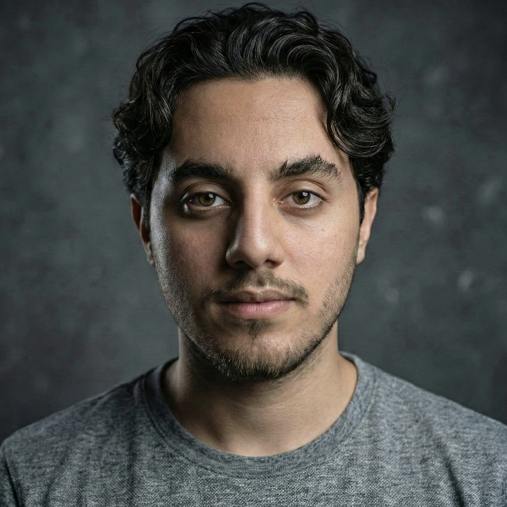
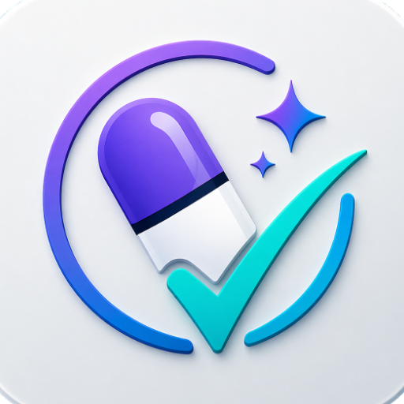
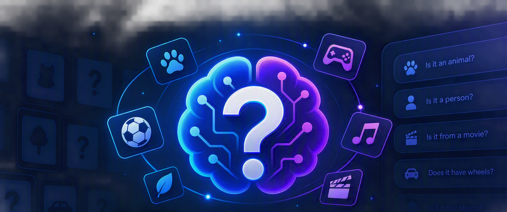
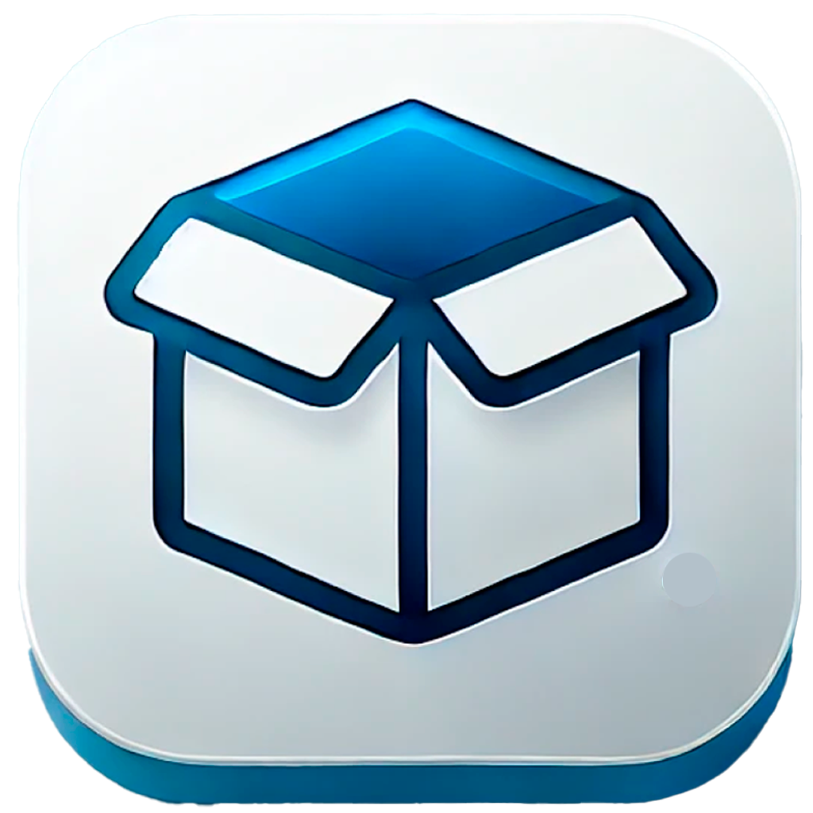
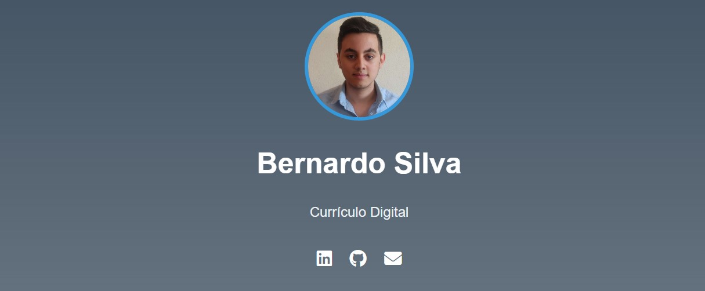
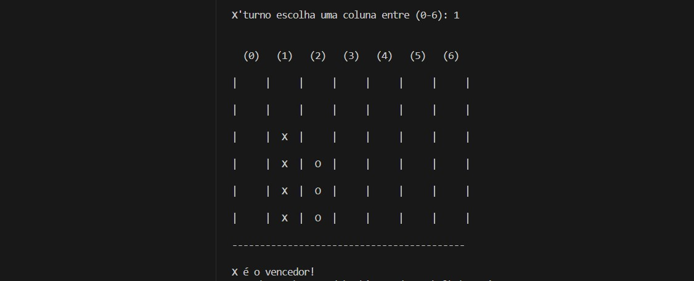
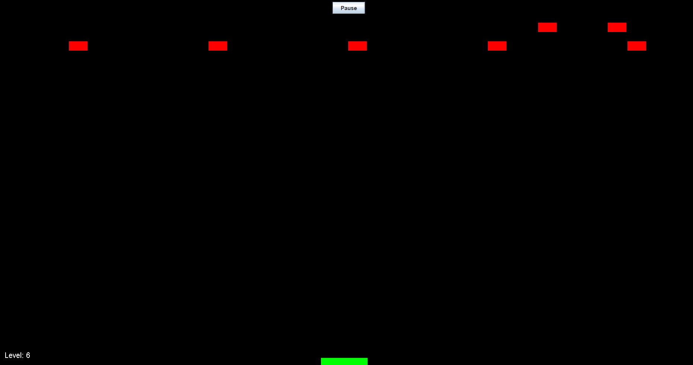
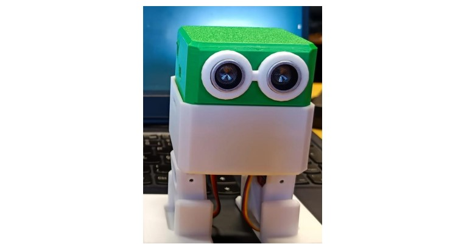
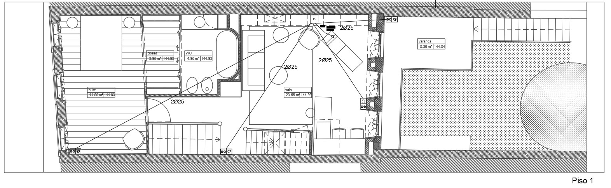
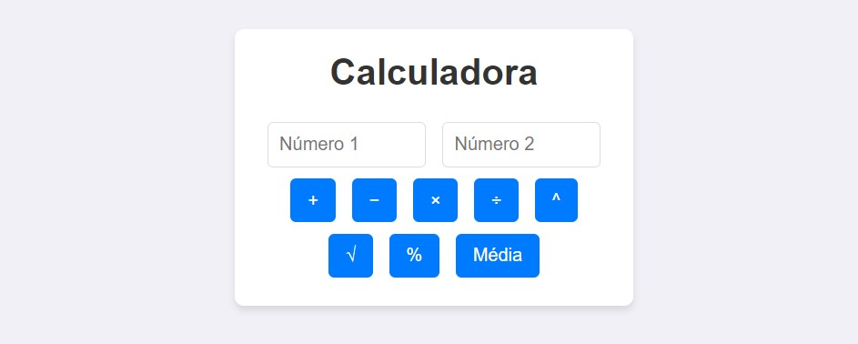

This file is a merged representation of a subset of the codebase, containing specifically included files, combined into a single document by Repomix.

<file_summary>
This section contains a summary of this file.

<purpose>
This file contains a packed representation of a subset of the repository's contents that is considered the most important context.
It is designed to be easily consumable by AI systems for analysis, code review,
or other automated processes.
</purpose>

<file_format>
The content is organized as follows:
1. This summary section
2. Repository information
3. Directory structure
4. Repository files (if enabled)
5. Multiple file entries, each consisting of:
  - File path as an attribute
  - Full contents of the file
</file_format>

<usage_guidelines>
- This file should be treated as read-only. Any changes should be made to the
  original repository files, not this packed version.
- When processing this file, use the file path to distinguish
  between different files in the repository.
- Be aware that this file may contain sensitive information. Handle it with
  the same level of security as you would the original repository.
</usage_guidelines>

<notes>
- Some files may have been excluded based on .gitignore rules and Repomix's configuration
- Binary files are not included in this packed representation. Please refer to the Repository Structure section for a complete list of file paths, including binary files
- Only files matching these patterns are included: index.html, formacao.html, experiencias.html, contacto.html, competencias.html, css/**, js/**, README.md, sitemap.xml, robots.txt, assets/favicon/site.webmanifest
- Files matching patterns in .gitignore are excluded
- Files matching default ignore patterns are excluded
- Files are sorted by Git change count (files with more changes are at the bottom)
</notes>

</file_summary>

<directory_structure>
assets/
  favicon/
    site.webmanifest
css/
  contact.css
  core.css
  education.css
  experience.css
  home.css
  readability.css
  skills.css
js/
  contact.js
  core.js
  experience.js
competencias.html
contacto.html
experiencias.html
formacao.html
index.html
README.md
sitemap.xml
</directory_structure>

<files>
This section contains the contents of the repository's files.

<file path="assets/favicon/site.webmanifest">
{
    "name": "Currículo Digital - Bernardo Silva",
    "short_name": "Bernardo CV",
    "icons": [
        {
            "src": "android-chrome-192x192.png",
            "sizes": "192x192",
            "type": "image/png"
        },
        {
            "src": "android-chrome-512x512.png",
            "sizes": "512x512",
            "type": "image/png"
        }
    ],
    "theme_color": "#0d6efd",
    "background_color": "#ffffff",
    "display": "standalone",
    "start_url": "../index.html"
}
</file>

<file path="css/contact.css">
.contact-hero{position:relative;display:flex;align-items:center;min-height:680px;overflow:hidden;background:#020811}.contact-visual{position:absolute;inset:0 0 0 45%;display:flex;align-items:center;justify-content:center;gap:1.5rem;color:#fff;background:radial-gradient(circle at 50% 45%,rgba(19,153,255,.28),transparent 25%),linear-gradient(135deg,#102440,#17183e)}.contact-visual>i{display:grid;place-items:center;width:120px;height:120px;background:rgba(255,255,255,.07);border:1px solid rgba(255,255,255,.16);border-radius:24px;font-size:3rem;transition:transform .35s}.contact-visual>i:nth-of-type(2){color:#6ee7e0}.contact-visual>i:nth-of-type(3){color:#b69fff}.contact-visual>span{width:70px;height:1px;background:linear-gradient(90deg,transparent,#65caff,transparent)}.contact-hero:hover .contact-visual>i{transform:translateY(-7px)}.hero-shade{position:absolute;inset:0;background:linear-gradient(90deg,#020811 0%,#020811 32%,rgba(2,8,17,.9) 53%,rgba(2,8,17,.2))}.hero-content{position:relative;padding-top:calc(var(--nav-height) + 5rem);padding-bottom:5rem}.hero-label{margin:0;color:var(--green);font-size:.82rem;font-weight:800}.hero-label i{margin-right:.45rem}.contact-hero h1{max-width:850px;margin:1rem 0;font-family:"Manrope",sans-serif;font-size:clamp(3.6rem,6.6vw,6.5rem);font-weight:800;letter-spacing:-.07em;line-height:.92}.contact-hero h1 span{color:var(--blue-light)}.hero-content>p:not(.hero-label){max-width:620px;color:#c6d0dc;font-size:1.05rem;line-height:1.75}.hero-actions{display:flex;gap:.7rem;margin-top:1.8rem}.availability{display:flex;align-items:center;gap:.65rem;margin-top:1.6rem;color:#d8e1ea;font-size:.78rem}.availability>span{width:.65rem;height:.65rem;background:var(--green);border-radius:50%;box-shadow:0 0 0 6px rgba(53,228,164,.12)}.channels-section{margin-top:-2rem}.channel-grid{display:grid;grid-template-columns:repeat(2,1fr);gap:1rem}.channel-card{display:grid;grid-template-columns:70px 1fr auto;gap:1rem;align-items:center;padding:1rem;background:var(--surface);border:1px solid var(--line);border-radius:var(--radius);transition:transform .28s,border-color .28s,box-shadow .28s}.channel-card:hover{color:var(--text);border-color:var(--blue);transform:translateY(-6px);box-shadow:var(--shadow)}.channel-icon{display:grid;place-items:center;width:62px;height:62px;color:#fff;border-radius:15px;font-size:1.4rem;transition:transform .3s}.channel-card:hover .channel-icon{transform:scale(1.08) rotate(-4deg)}.channel-email .channel-icon{background:linear-gradient(135deg,#087fc9,#18a9cc)}.channel-linkedin .channel-icon{background:linear-gradient(135deg,#0766a6,#0a88cf)}.channel-github .channel-icon{background:linear-gradient(135deg,#3b4552,#151a20)}.channel-location .channel-icon{background:linear-gradient(135deg,#6846be,#425ec3)}.channel-card small,.channel-card strong,.channel-card em{display:block}.channel-card small{color:var(--blue-light);font-size:.65rem;text-transform:uppercase}.channel-card strong{margin:.12rem 0;font-size:.9rem}.channel-card em{color:var(--muted);font-size:.72rem;font-style:normal}.channel-card>i{margin-right:.3rem;color:var(--muted);font-size:.8rem}.message-layout{display:grid;grid-template-columns:.75fr 1.25fr;gap:1rem}.message-guide,.form-panel{padding:1.5rem;background:var(--surface);border:1px solid var(--line);border-radius:var(--radius)}.message-guide h3{margin:0 0 1rem;font-family:"Manrope";font-size:1.1rem}.message-guide ol{display:grid;gap:.75rem;padding:0;margin:0;list-style:none}.message-guide li{display:grid;grid-template-columns:44px 1fr;gap:.8rem;padding:.85rem;background:var(--surface-2);border:1px solid var(--line);border-radius:12px}.message-guide li>span{display:grid;place-items:center;width:40px;height:40px;color:#fff;background:linear-gradient(135deg,var(--blue),#6152c7);border-radius:10px;font-size:.7rem;font-weight:800}.message-guide strong{font-size:.82rem}.message-guide p{margin:.2rem 0 0;color:var(--muted);font-size:.72rem;line-height:1.5}.privacy-note{display:flex;gap:.7rem;margin-top:1rem;padding:.85rem;color:var(--muted);background:rgba(19,153,255,.07);border:1px solid rgba(19,153,255,.16);border-radius:12px}.privacy-note i{color:var(--blue-light)}.privacy-note p{margin:0;font-size:.7rem}.form-panel{padding:1.7rem}.form-label{display:flex;align-items:center;gap:.45rem;margin-bottom:.5rem;color:var(--text);font-size:.8rem;font-weight:700}.form-label i{color:var(--blue-light)}.form-control{min-height:52px;padding:.8rem .9rem;color:var(--text);background:var(--surface-2);border:1px solid var(--line);border-radius:11px;font-size:.9rem}.form-control::placeholder{color:var(--muted);opacity:.75}textarea.form-control{min-height:190px;resize:vertical}.form-control:focus{color:var(--text);background:var(--surface-2);border-color:var(--blue);box-shadow:0 0 0 .2rem rgba(19,153,255,.13)}.field-meta{display:flex;justify-content:space-between;gap:1rem;margin-top:.45rem;color:var(--muted);font-size:.68rem}.limit-warning{color:#ffbb48!important}.limit-danger{color:#ff647c!important}.honeypot{position:absolute!important;left:-10000px!important;width:1px!important;height:1px!important;overflow:hidden!important}.submit-row{display:flex;align-items:center;justify-content:space-between;gap:1rem}.send-button{display:inline-flex;align-items:center;gap:.55rem;padding:.8rem 1rem;color:#07101c;background:#fff;border:0;border-radius:10px;font-size:.82rem;font-weight:800;transition:transform .2s,box-shadow .2s}.send-button:hover{transform:scale(1.03);box-shadow:0 12px 25px rgba(0,0,0,.2)}.send-button:disabled{cursor:not-allowed;opacity:.7}.submit-row p{max-width:310px;margin:0;color:var(--muted);font-size:.68rem}.explore-grid{display:grid;grid-template-columns:repeat(3,1fr);gap:1rem}.explore-grid>a{display:grid;grid-template-columns:55px 1fr auto;gap:.8rem;align-items:center;padding:1rem;background:var(--surface);border:1px solid var(--line);border-radius:var(--radius);transition:transform .25s,border-color .25s}.explore-grid>a:hover{color:var(--text);border-color:var(--blue);transform:translateY(-5px)}.explore-grid>a>i:first-child{display:grid;place-items:center;width:50px;height:50px;color:var(--blue-light);background:rgba(19,153,255,.11);border-radius:11px}.explore-grid strong,.explore-grid small{display:block}.explore-grid strong{font-size:.8rem}.explore-grid small{margin-top:.2rem;color:var(--muted);font-size:.64rem}.explore-grid>a>i:last-child{color:var(--muted);font-size:.7rem}
[data-bs-theme="light"] .contact-hero{color:#f5f7fa}[data-bs-theme="light"] .hero-content>p:not(.hero-label){color:#c6d0dc}
@media(max-width:991.98px){.contact-visual{inset:0;opacity:.45}.hero-shade{background:linear-gradient(0deg,#020811 4%,rgba(2,8,17,.9) 67%,rgba(2,8,17,.55))}.message-layout{grid-template-columns:1fr}.explore-grid{grid-template-columns:1fr}}
@media(max-width:767.98px){.contact-hero{min-height:650px}.channel-grid{grid-template-columns:1fr}.contact-visual>i{width:90px;height:90px}.contact-visual>span{width:30px}}
@media(max-width:575.98px){.contact-hero h1{font-size:3.3rem}.hero-actions{flex-wrap:wrap}.channel-card{grid-template-columns:60px 1fr auto}.channel-icon{width:54px;height:54px}.form-panel,.message-guide{padding:1.1rem}.submit-row{align-items:flex-start;flex-direction:column}.send-button{width:100%;justify-content:center}}
</file>

<file path="css/education.css">
.education-hero{position:relative;display:flex;align-items:center;min-height:680px;overflow:hidden;background:#020811}.hero-campus{position:absolute;inset:0 0 0 42%;display:flex;align-items:center;justify-content:center;gap:3rem;color:rgba(255,255,255,.82);background:radial-gradient(circle at 55% 44%,rgba(19,153,255,.32),transparent 27%),linear-gradient(135deg,#102440,#1c1a45)}.hero-campus i{font-size:clamp(3rem,8vw,8rem);filter:drop-shadow(0 14px 30px rgba(0,0,0,.3));transition:transform .4s}.hero-campus i:nth-child(2){color:#65d9ff;transform:translateY(-90px) scale(.7)}.hero-campus i:nth-child(3){color:#a88dff;transform:translateY(95px) scale(.72)}.education-hero:hover .hero-campus i:first-child{transform:scale(1.05)}.hero-shade{position:absolute;inset:0;background:linear-gradient(90deg,#020811 0%,#020811 31%,rgba(2,8,17,.88) 53%,rgba(2,8,17,.18))}.hero-content{position:relative;padding-top:calc(var(--nav-height) + 5rem);padding-bottom:5rem}.hero-label{margin:0;color:var(--green);font-size:.74rem;font-weight:800}.hero-label i{margin-right:.4rem}.education-hero h1{max-width:880px;margin:1rem 0;font-family:"Manrope",sans-serif;font-size:clamp(3.5rem,6.5vw,6.4rem);font-weight:800;letter-spacing:-.07em;line-height:.93}.education-hero h1 span{color:var(--blue-light)}.hero-content>p:not(.hero-label){max-width:610px;color:#c4cfdb;font-size:1rem;line-height:1.72}.hero-actions{display:flex;gap:.7rem;margin-top:1.8rem}.hero-facts{display:flex;flex-wrap:wrap;gap:2rem;margin-top:1.8rem}.hero-facts span{color:#a8b5c4;font-size:.65rem}.hero-facts strong{display:block;color:#fff;font-size:1.18rem}.degree-section{margin-top:-2rem}.period{color:var(--muted);font-size:.7rem}.degree-feature{display:grid;grid-template-columns:290px 1fr;overflow:hidden;background:var(--surface);border:1px solid var(--line);border-radius:var(--radius);box-shadow:var(--shadow)}.degree-visual{position:relative;display:flex;align-items:center;justify-content:center;flex-direction:column;min-height:390px;color:#fff;background:radial-gradient(circle at 50% 35%,rgba(101,217,255,.2),transparent 28%),linear-gradient(145deg,#1175c6,#252b70)}.degree-visual>i{font-size:4.3rem}.degree-visual>span{margin-top:1rem;font-family:"Manrope";font-size:3.3rem;font-weight:800}.degree-visual>small{font-size:.62rem;text-transform:uppercase}.degree-content{padding:1.8rem}.institution{margin:0;color:var(--blue-light);font-size:.62rem;font-weight:800;text-transform:uppercase}.degree-content h3{margin:.55rem 0 .8rem;font-family:"Manrope";font-size:1.65rem}.degree-content>p:not(.institution){color:var(--muted);font-size:.76rem}.learning-row{display:grid;grid-template-columns:repeat(2,1fr);margin-top:1.2rem;border-top:1px solid var(--line)}.learning-row>span{display:grid;grid-template-columns:auto 1fr;gap:.16rem .55rem;padding:.85rem;border-right:1px solid var(--line);border-bottom:1px solid var(--line)}.learning-row>span:nth-child(even){border-right:0}.learning-row i{grid-row:1/3;color:var(--blue-light)}.learning-row strong,.learning-row small{display:block}.learning-row strong{font-size:.67rem}.learning-row small{color:var(--muted);font-size:.54rem}.degree-buttons{display:flex;gap:.55rem;margin-top:1.2rem}.degree-buttons a,.certificate-content>a,.prior-banner>a{display:inline-flex;align-items:center;gap:.4rem;padding:.5rem .65rem;color:#07101c;background:#fff;border-radius:8px;font-size:.63rem;font-weight:800}.degree-buttons a:last-child{color:var(--text);background:transparent;border:1px solid var(--line)}.certificate-grid{display:grid;grid-template-columns:repeat(3,minmax(0,1fr));gap:1rem}.certificate-card{display:grid;grid-template-columns:105px 1fr;min-height:245px;overflow:hidden;background:var(--surface);border:1px solid var(--line);border-radius:var(--radius);transition:transform .28s,border-color .28s,box-shadow .28s}.certificate-card:hover{transform:scale(1.025);border-color:var(--blue);box-shadow:var(--shadow)}.certificate-art{position:relative;display:flex;align-items:center;justify-content:center;flex-direction:column;color:#fff;background:linear-gradient(145deg,#167ec5,#283f89)}.certificate-art i{font-size:2rem;transition:transform .3s}.certificate-card:hover .certificate-art i{transform:scale(1.12) rotate(-5deg)}.certificate-art span{margin-top:.7rem;color:rgba(255,255,255,.82);font-family:"Manrope";font-size:1.25rem;font-weight:800}.certificate-english .certificate-art{background:linear-gradient(145deg,#187ca1,#175968)}.certificate-5g .certificate-art{background:linear-gradient(145deg,#6a45bd,#3357b1)}.certificate-server .certificate-art{background:linear-gradient(145deg,#215a97,#283d65)}.certificate-front .certificate-art{background:linear-gradient(145deg,#cb5b26,#8e3620)}.certificate-network .certificate-art{background:linear-gradient(145deg,#1687c1,#17517e)}.certificate-security .certificate-art{background:linear-gradient(145deg,#24569a,#212c53)}.certificate-ai .certificate-art{background:linear-gradient(145deg,#6f4ac2,#3247a6)}.certificate-content{display:flex;align-items:flex-start;flex-direction:column;padding:1rem}.certificate-date{align-self:flex-end;color:var(--muted);font-size:.55rem}.certificate-content>small{color:var(--blue-light);font-size:.56rem;text-transform:uppercase}.certificate-content h3{margin:.4rem 0;font-family:"Manrope";font-size:.88rem}.certificate-content p{margin:0;color:var(--muted);font-size:.62rem}.certificate-content>a{margin-top:auto}.applied-grid{display:grid;grid-template-columns:repeat(4,1fr);gap:1rem}.applied-grid article{position:relative;min-height:220px;padding:1.1rem;background:linear-gradient(145deg,var(--surface),var(--surface-2));border:1px solid var(--line);border-radius:var(--radius);transition:transform .25s,border-color .25s}.applied-grid article:hover{transform:translateY(-6px);border-color:var(--blue)}.applied-grid>article>span{position:absolute;top:.7rem;right:.8rem;color:rgba(133,158,188,.2);font-family:"Manrope";font-size:2.5rem;font-weight:800}.applied-grid>article>i{display:grid;place-items:center;width:2.8rem;height:2.8rem;color:var(--blue-light);background:rgba(19,153,255,.11);border-radius:11px}.applied-grid h3{margin:1.1rem 0 .45rem;font-size:.78rem}.applied-grid p{margin:0;color:var(--muted);font-size:.64rem}.prior-banner{display:grid;grid-template-columns:110px 1fr auto;gap:1.2rem;align-items:center;padding:1rem;background:var(--surface);border:1px solid var(--line);border-radius:var(--radius)}.prior-icon{display:grid;place-items:center;height:90px;color:#fff;background:linear-gradient(135deg,#147ec5,#3d4ca2);border-radius:12px;font-size:2rem}.prior-banner small{color:var(--blue-light);font-size:.58rem}.prior-banner h3{margin:.25rem 0;font-family:"Manrope";font-size:1rem}.prior-banner p{margin:0;color:var(--muted);font-size:.66rem}.prior-banner>a{margin-right:.5rem}.contact-feature{margin-top:2rem;padding:5rem 0;background:linear-gradient(120deg,#0876c2,#253795)}.contact-feature-inner{display:flex;align-items:center;justify-content:space-between;gap:2rem}.contact-feature p{margin:0;color:#bde7ff;font-size:.66rem;text-transform:uppercase}.contact-feature h2{max-width:760px;margin:.4rem 0 0;font-family:"Manrope";font-size:clamp(2rem,4vw,3.2rem)}.contact-feature-inner>div:last-child{display:flex;gap:.7rem;flex-shrink:0}
[data-bs-theme="light"] .education-hero,[data-bs-theme="light"] .degree-visual,[data-bs-theme="light"] .certificate-art,[data-bs-theme="light"] .contact-feature{color:#f5f7fa}[data-bs-theme="light"] .hero-content>p:not(.hero-label){color:#c6d0dc}
@media(max-width:1199.98px){.certificate-grid{grid-template-columns:repeat(2,1fr)}}
@media(max-width:991.98px){.degree-feature{grid-template-columns:220px 1fr}.applied-grid{grid-template-columns:repeat(2,1fr)}.contact-feature-inner{align-items:flex-start;flex-direction:column}}
@media(max-width:767.98px){.education-hero{min-height:650px}.hero-campus{inset:0;opacity:.55}.hero-shade{background:linear-gradient(0deg,#020811 5%,rgba(2,8,17,.88) 65%,rgba(2,8,17,.55))}.degree-feature{grid-template-columns:1fr}.degree-visual{min-height:220px}.certificate-grid{grid-template-columns:1fr}.prior-banner{grid-template-columns:80px 1fr}.prior-banner>a{grid-column:2;width:max-content}}
@media(max-width:575.98px){.education-hero h1{font-size:3.25rem}.hero-actions{flex-wrap:wrap}.hero-facts{gap:1rem}.learning-row{grid-template-columns:1fr}.learning-row>span{border-right:0}.certificate-card{grid-template-columns:90px 1fr}.applied-grid{grid-template-columns:1fr}.prior-banner{grid-template-columns:1fr}.prior-banner>a{grid-column:auto}.contact-feature-inner>div:last-child{width:100%}.contact-feature .watch-button{flex:1}}
</file>

<file path="css/readability.css">
/* =====================================================
   BERNARDO SILVA PORTFOLIO - READABILITY.CSS
   Global readability pass for all cinematic pages
   Load this file AFTER the page-specific CSS.
===================================================== */

/* Global navigation and catalogue headings */
.navbar-brand small { font-size: 0.68rem; }
.portfolio-nav .nav-link { font-size: 0.9rem; }
.portfolio-nav .nav-link i { font-size: 0.8rem; }
.row-heading p { font-size: 0.75rem; }
.row-heading > a { font-size: 0.82rem; }
.site-footer p,
.footer-links a { font-size: 0.8rem; }

/* Shared cinematic hero details */
.hero-label { font-size: 0.82rem; }
.hero-meta,
.hero-note,
.hero-facts span,
.hero-stack span,
.availability { font-size: 0.78rem; }

/* Homepage */
.tile-content p { font-size: 0.84rem; line-height: 1.55; }
.rank { font-size: 0.72rem; }
.tile-buttons a { font-size: 0.76rem; }
.profile-badge { font-size: 0.74rem; }
.profile-copy p { font-size: 0.94rem; }
.detail-button { font-size: 0.8rem; }
.profile-categories strong { font-size: 0.86rem; }
.profile-categories small { font-size: 0.72rem; }
.landscape-card small { font-size: 0.7rem; }
.skill-row strong { font-size: 0.84rem; }
.skill-row small { font-size: 0.7rem; line-height: 1.45; }
.cv-row small { font-size: 0.72rem; }
.contact-feature p { font-size: 0.76rem; }

/* Projects and Experience */
.experience-hero .hero-content > p:not(.hero-label) { font-size: 1.05rem; line-height: 1.75; }
.project-copy .status,
.status { font-size: 0.72rem; }
.project-copy p { font-size: 0.84rem; line-height: 1.55; }
.project-copy li { font-size: 0.7rem; }
.project-buttons a { font-size: 0.76rem; }
.metrics span { font-size: 0.68rem; }
.metrics strong { font-size: 0.82rem; }
.period { font-size: 0.78rem; }
.company-block small { font-size: 0.72rem; }
.role-banner > p { font-size: 0.9rem; line-height: 1.65; }
.role-row strong { font-size: 0.8rem; }
.role-row small { font-size: 0.7rem; line-height: 1.4; }
.site-grid small { font-size: 0.7rem; }
.project-filter { font-size: 0.78rem; }
.archive-card span { font-size: 0.7rem; }
.archive-card h3 { font-size: 1.02rem; }
.archive-card p { font-size: 0.8rem; line-height: 1.55; }
.archive-card a { font-size: 0.76rem; }

/* Skills */
.skills-hero .hero-content > p:not(.hero-label) { font-size: 1.05rem; }
.domain-label { font-size: 0.7rem; }
.domain-content h3 { font-size: 1.42rem; }
.domain-content > p:not(.domain-label) { font-size: 0.84rem; line-height: 1.6; }
.domain-content li { font-size: 0.7rem; }
.proof span { font-size: 0.72rem; }
.proof strong { font-size: 0.78rem; }
.evidence-row small { font-size: 0.68rem; }
.evidence-row strong { font-size: 0.86rem; }
.evidence-row em { font-size: 0.7rem; }
.process-row p { font-size: 0.78rem; line-height: 1.55; }
.foundation-grid h3 { font-size: 0.96rem; }
.foundation-grid p { font-size: 0.78rem; line-height: 1.55; }
.foundation-grid article > div span { font-size: 0.68rem; }
.language-row strong { font-size: 0.88rem; }
.language-row small { font-size: 0.72rem; }

/* Education */
.education-hero .hero-content > p:not(.hero-label) { font-size: 1.05rem; }
.degree-visual > small { font-size: 0.74rem; }
.institution { font-size: 0.74rem; line-height: 1.5; }
.degree-content h3 { font-size: 1.85rem; }
.degree-content > p:not(.institution) { font-size: 0.9rem; line-height: 1.65; }
.learning-row strong { font-size: 0.82rem; }
.learning-row small { font-size: 0.72rem; line-height: 1.45; }
.degree-buttons a,
.certificate-content > a,
.prior-banner > a { font-size: 0.78rem; padding: 0.62rem 0.78rem; }
.certificate-card { min-height: 285px; }
.certificate-content { padding: 1.2rem; }
.certificate-date { font-size: 0.7rem; }
.certificate-content > small { font-size: 0.7rem; line-height: 1.4; }
.certificate-content h3 { font-size: 1.05rem; line-height: 1.35; }
.certificate-content p { font-size: 0.8rem; line-height: 1.55; }
.applied-grid h3 { font-size: 0.94rem; line-height: 1.4; }
.applied-grid p { font-size: 0.8rem; line-height: 1.55; }
.prior-banner small { font-size: 0.7rem; }
.prior-banner h3 { font-size: 1.15rem; }
.prior-banner p { font-size: 0.8rem; line-height: 1.5; }

/* Contact */
.channel-card small { font-size: 0.72rem; }
.channel-card strong { font-size: 1rem; }
.channel-card em { font-size: 0.82rem; }
.message-guide h3 { font-size: 1.2rem; }
.message-guide li > span { font-size: 0.76rem; }
.message-guide strong { font-size: 0.92rem; }
.message-guide p { font-size: 0.82rem; line-height: 1.55; }
.privacy-note p { font-size: 0.78rem; line-height: 1.5; }
.form-label { font-size: 0.88rem; }
.form-control { font-size: 0.95rem; }
.field-meta { font-size: 0.74rem; }
.send-button { font-size: 0.88rem; }
.submit-row p { font-size: 0.76rem; line-height: 1.5; }
.explore-grid strong { font-size: 0.9rem; }
.explore-grid small { font-size: 0.74rem; line-height: 1.45; }

/* Preserve compactness on small screens without returning to tiny text */
@media (max-width: 575.98px) {
  .navbar-brand small { font-size: 0.62rem; }
  .portfolio-nav .nav-link { font-size: 0.86rem; }
  .certificate-content h3 { font-size: 1rem; }
  .certificate-content p,
  .applied-grid p,
  .domain-content > p:not(.domain-label),
  .archive-card p,
  .message-guide p { font-size: 0.78rem; }
}
</file>

<file path="css/skills.css">
.skills-hero{position:relative;display:flex;align-items:center;min-height:680px;overflow:hidden;background:#020811}.hero-code{position:absolute;inset:0 0 0 43%;display:flex;justify-content:center;flex-direction:column;gap:1.4rem;padding-left:12%;color:rgba(120,199,255,.18);font-family:monospace;font-size:clamp(1rem,2.2vw,2.1rem);transform:rotate(-5deg);background:radial-gradient(circle at 65% 45%,rgba(19,153,255,.22),transparent 33%),linear-gradient(135deg,#0e1d35,#171733)}.hero-code span:nth-child(2){color:rgba(57,225,188,.25)}.hero-code span:nth-child(3){color:rgba(165,137,255,.25)}.hero-shade{position:absolute;inset:0;background:linear-gradient(90deg,#020811 0%,#020811 31%,rgba(2,8,17,.86) 52%,rgba(2,8,17,.18))}.hero-content{position:relative;padding-top:calc(var(--nav-height) + 5rem);padding-bottom:5rem}.hero-label{margin:0;color:var(--green);font-size:.74rem;font-weight:800}.hero-label i{margin-right:.4rem}.skills-hero h1{max-width:850px;margin:1rem 0;font-family:"Manrope",sans-serif;font-size:clamp(3.5rem,6.6vw,6.5rem);font-weight:800;letter-spacing:-.07em;line-height:.93}.skills-hero h1 span{color:var(--blue-light)}.hero-content>p:not(.hero-label){max-width:610px;color:#c3ceda;font-size:1rem;line-height:1.72}.hero-actions{display:flex;gap:.7rem;margin-top:1.8rem}.hero-stack{display:flex;flex-wrap:wrap;gap:.6rem;margin-top:1.7rem}.hero-stack span{display:flex;align-items:center;gap:.4rem;padding:.45rem .65rem;color:#d3dde8;background:rgba(255,255,255,.06);border:1px solid rgba(255,255,255,.1);border-radius:8px;font-size:.64rem;font-weight:700}.hero-stack i{color:var(--blue-light)}.core-section{margin-top:-2rem}.domain-grid{display:grid;grid-template-columns:repeat(2,minmax(0,1fr));gap:1rem}.domain-card{display:grid;grid-template-columns:170px minmax(0,1fr);min-height:340px;overflow:hidden;background:var(--surface);border:1px solid var(--line);border-radius:var(--radius);transition:transform .3s,border-color .3s,box-shadow .3s}.domain-card:hover{z-index:2;transform:scale(1.025);border-color:var(--blue);box-shadow:var(--shadow)}.domain-art{position:relative;display:grid;place-items:center;overflow:hidden;color:#fff;font-size:4rem}.domain-art::before,.domain-art::after{position:absolute;content:"";border:1px solid rgba(255,255,255,.15);border-radius:50%}.domain-art::before{width:150px;height:150px}.domain-art::after{width:95px;height:95px}.domain-art>i{position:relative;z-index:1;transition:transform .35s}.domain-card:hover .domain-art>i{transform:scale(1.13) rotate(-6deg)}.domain-art>span{position:absolute;right:.8rem;bottom:.4rem;color:rgba(255,255,255,.16);font-family:"Manrope";font-size:3rem;font-weight:800}.domain-mobile .domain-art{background:linear-gradient(145deg,#087fc8,#143d82)}.domain-data .domain-art{background:linear-gradient(145deg,#008780,#15517c)}.domain-ai .domain-art{background:linear-gradient(145deg,#7548c9,#283e91)}.domain-ops .domain-art{background:linear-gradient(145deg,#255a9b,#253553)}.domain-content{display:flex;flex-direction:column;padding:1.3rem}.domain-label{margin:0;color:var(--blue-light);font-size:.59rem;font-weight:800;letter-spacing:.09em;text-transform:uppercase}.domain-content h3{margin:.35rem 0 .55rem;font-family:"Manrope";font-size:1.3rem}.domain-content>p:not(.domain-label){margin:0;color:var(--muted);font-size:.72rem}.domain-content ul{display:flex;flex-wrap:wrap;gap:.35rem;padding:0;margin:1rem 0;list-style:none}.domain-content li{padding:.25rem .4rem;color:#cbd5df;background:rgba(255,255,255,.05);border:1px solid var(--line);border-radius:6px;font-size:.55rem}[data-bs-theme="light"] .domain-content li{color:var(--text);background:var(--surface-2)}.proof{display:flex;align-items:center;gap:.65rem;margin-top:auto;padding-top:.85rem;border-top:1px solid var(--line);color:var(--muted)}.proof>i{color:var(--green);font-size:1rem}.proof span{font-size:.59rem;line-height:1.45}.proof strong{display:block;color:var(--text);font-size:.64rem}.evidence-row{display:grid;grid-template-columns:repeat(3,1fr);gap:1rem}.evidence-row>a{display:grid;grid-template-columns:76px 1fr auto;gap:.8rem;align-items:center;padding:.85rem;background:var(--surface);border:1px solid var(--line);border-radius:var(--radius);transition:transform .25s,border-color .25s}.evidence-row>a:hover{color:var(--text);border-color:var(--blue);transform:translateY(-5px)}.evidence-icon{display:grid;place-items:center;width:65px;height:65px;color:#fff;border-radius:12px;font-size:1.35rem}.evidence-icon.play{background:linear-gradient(135deg,#14854b,#24b879)}.evidence-icon.mind{background:linear-gradient(135deg,#3d63c5,#864bd0)}.evidence-icon.work{background:linear-gradient(135deg,#147fc5,#16a3bb)}.evidence-row small,.evidence-row strong,.evidence-row em{display:block}.evidence-row small{color:var(--blue-light);font-size:.55rem;text-transform:uppercase}.evidence-row strong{margin:.15rem 0;font-size:.76rem}.evidence-row em{color:var(--muted);font-size:.56rem;font-style:normal}.evidence-row>a>i{color:var(--muted);font-size:.7rem}.process-row{display:grid;grid-template-columns:repeat(4,1fr);gap:1rem;padding:0;margin:0;list-style:none}.process-row li{position:relative;min-height:210px;padding:1.2rem;background:linear-gradient(145deg,var(--surface),var(--surface-2));border:1px solid var(--line);border-radius:var(--radius);transition:transform .25s,border-color .25s}.process-row li:hover{transform:translateY(-6px);border-color:var(--blue)}.process-row>li>span{position:absolute;top:.8rem;right:.9rem;color:rgba(130,158,189,.2);font-family:"Manrope";font-size:2.5rem;font-weight:800}.process-row>li>i{display:grid;place-items:center;width:2.8rem;height:2.8rem;color:var(--blue-light);background:rgba(19,153,255,.12);border-radius:11px}.process-row strong{display:block;margin-top:1.2rem;font-family:"Manrope"}.process-row p{margin:.4rem 0 0;color:var(--muted);font-size:.68rem}.foundation-grid{display:grid;grid-template-columns:repeat(4,1fr);gap:1rem}.foundation-grid article{padding:1.2rem;background:var(--surface);border:1px solid var(--line);border-radius:var(--radius);transition:transform .25s,border-color .25s}.foundation-grid article:hover{transform:translateY(-6px);border-color:var(--blue)}.foundation-icon{display:grid;place-items:center;width:3rem;height:3rem;color:var(--blue-light);background:rgba(19,153,255,.1);border-radius:12px;font-size:1.25rem}.foundation-grid h3{margin:1rem 0 .45rem;font-size:.86rem}.foundation-grid p{min-height:65px;margin:0;color:var(--muted);font-size:.65rem}.foundation-grid article>div{display:flex;flex-wrap:wrap;gap:.3rem;margin-top:.8rem}.foundation-grid article>div span{padding:.22rem .35rem;color:#b9c6d4;background:rgba(255,255,255,.04);border-radius:5px;font-size:.52rem}.language-row{display:grid;grid-template-columns:repeat(3,1fr);gap:1rem}.language-row article{display:grid;grid-template-columns:58px 1fr auto;gap:.8rem;align-items:center;padding:1rem;background:var(--surface);border:1px solid var(--line);border-radius:var(--radius);transition:transform .25s,border-color .25s}.language-row article:hover{transform:translateY(-5px);border-color:var(--blue)}.language-symbol{display:grid;place-items:center;width:52px;height:52px;color:#fff;background:linear-gradient(135deg,var(--blue),#6555ca);border-radius:12px;font-family:"Manrope";font-weight:800}.language-row strong,.language-row small{display:block}.language-row strong{font-size:.78rem}.language-row small{margin-top:.2rem;color:var(--muted);font-size:.6rem}.language-row article>i{color:var(--green)}.contact-feature{margin-top:2rem;padding:5rem 0;background:linear-gradient(120deg,#0876c2,#253795)}.contact-feature-inner{display:flex;align-items:center;justify-content:space-between;gap:2rem}.contact-feature p{margin:0;color:#bde7ff;font-size:.66rem;text-transform:uppercase}.contact-feature h2{max-width:760px;margin:.4rem 0 0;font-family:"Manrope";font-size:clamp(2rem,4vw,3.2rem)}.contact-feature-inner>div:last-child{display:flex;gap:.7rem;flex-shrink:0}
[data-bs-theme="light"] .skills-hero,[data-bs-theme="light"] .contact-feature{color:#f5f7fa}[data-bs-theme="light"] .hero-content>p:not(.hero-label){color:#c6d0dc}
@media(max-width:1100px){.process-row,.foundation-grid{grid-template-columns:repeat(2,1fr)}}
@media(max-width:991.98px){.domain-grid{grid-template-columns:1fr}.evidence-row{grid-template-columns:1fr}.contact-feature-inner{align-items:flex-start;flex-direction:column}}
@media(max-width:767.98px){.skills-hero{min-height:650px}.hero-code{inset:0;opacity:.48}.hero-shade{background:linear-gradient(0deg,#020811 5%,rgba(2,8,17,.86) 65%,rgba(2,8,17,.58))}.domain-card{grid-template-columns:125px 1fr}.language-row{grid-template-columns:1fr}}
@media(max-width:575.98px){.skills-hero h1{font-size:3.3rem}.hero-actions{flex-wrap:wrap}.domain-card{grid-template-columns:1fr}.domain-art{min-height:135px}.process-row,.foundation-grid{grid-template-columns:1fr}.foundation-grid p{min-height:0}.contact-feature-inner>div:last-child{width:100%}.contact-feature .watch-button{flex:1}}
</file>

<file path="js/contact.js">
"use strict";
document.addEventListener("DOMContentLoaded",()=>{const form=document.getElementById("contactForm"),message=document.getElementById("messageText"),counter=document.getElementById("messageCounter"),honeypot=document.getElementById("companyWebsite"),submit=form?.querySelector('button[type="submit"]');const update=()=>{if(!message||!counter)return;const current=message.value.length,max=Number(message.maxLength)||3000,remaining=max-current;counter.textContent=`${current} / ${max}`;counter.classList.toggle("limit-warning",remaining<=300&&remaining>50);counter.classList.toggle("limit-danger",remaining<=50)};message?.addEventListener("input",update);update();form?.addEventListener("submit",event=>{if(Boolean(honeypot?.value.trim())||!form.checkValidity()){event.preventDefault();event.stopPropagation();form.classList.add("was-validated");return}form.classList.add("was-validated");if(submit){submit.disabled=true;submit.setAttribute("aria-busy","true");submit.innerHTML='<i class="fa-solid fa-spinner fa-spin"></i><span>Sending</span>'}})});
</file>

<file path="js/core.js">
/* =====================================================
   BERNARDO SILVA PORTFOLIO - CORE.JS
   Global interactions shared by every page
===================================================== */

"use strict";

(() => {
  const root = document.documentElement;
  const themeStorageKey = "portfolio-theme";
  const reducedMotionQuery = window.matchMedia("(prefers-reduced-motion: reduce)");
  const darkThemeQuery = window.matchMedia("(prefers-color-scheme: dark)");

  function getStoredTheme() {
    const storedTheme = localStorage.getItem(themeStorageKey);
    return storedTheme === "light" || storedTheme === "dark"
      ? storedTheme
      : null;
  }

  function getPreferredTheme() {
    return getStoredTheme() ?? (darkThemeQuery.matches ? "dark" : "light");
  }

  function updateThemeControls(theme) {
    const isDark = theme === "dark";

    document.querySelectorAll("[data-theme-toggle], #themeToggle").forEach((button) => {
      const icon = button.querySelector("i");

      button.setAttribute("aria-pressed", String(isDark));
      button.setAttribute(
        "aria-label",
        isDark ? "Switch to light mode" : "Switch to dark mode",
      );
      button.setAttribute(
        "title",
        isDark ? "Switch to light mode" : "Switch to dark mode",
      );

      if (icon) {
        icon.className = isDark ? "fa-solid fa-sun" : "fa-solid fa-moon";
        icon.setAttribute("aria-hidden", "true");
      }
    });
  }

  function applyTheme(theme, persist = false) {
    root.setAttribute("data-bs-theme", theme);
    updateThemeControls(theme);

    const themeColor = document.querySelector('meta[name="theme-color"]');
    if (themeColor) {
      themeColor.setAttribute("content", theme === "dark" ? "#061429" : "#07182f");
    }

    if (persist) {
      localStorage.setItem(themeStorageKey, theme);
    }
  }

  applyTheme(getPreferredTheme());

  document.addEventListener("DOMContentLoaded", () => {
    const progressBar = document.getElementById("readingProgressBar");
    const backToTop = document.getElementById("backToTop");
    const currentYear = document.getElementById("currentYear");
    const navigation = document.getElementById("navbarNav");

    document.querySelectorAll("[data-theme-toggle], #themeToggle").forEach((button) => {
      button.addEventListener("click", () => {
        const nextTheme =
          root.getAttribute("data-bs-theme") === "dark" ? "light" : "dark";
        applyTheme(nextTheme, true);
      });
    });

    function updateScrollInterface() {
      const scrollableHeight = document.documentElement.scrollHeight - window.innerHeight;
      const progress = scrollableHeight > 0 ? window.scrollY / scrollableHeight : 0;
      const percentage = Math.min(100, Math.max(0, progress * 100));

      if (progressBar) {
        progressBar.style.width = `${percentage}%`;
      }

      backToTop?.classList.toggle("visible", window.scrollY > 500);
    }

    let scrollFrame = null;

    function requestScrollUpdate() {
      if (scrollFrame !== null) return;

      scrollFrame = window.requestAnimationFrame(() => {
        updateScrollInterface();
        scrollFrame = null;
      });
    }

    window.addEventListener("scroll", requestScrollUpdate, { passive: true });
    window.addEventListener("resize", requestScrollUpdate, { passive: true });
    updateScrollInterface();

    backToTop?.addEventListener("click", () => {
      window.scrollTo({
        top: 0,
        behavior: reducedMotionQuery.matches ? "auto" : "smooth",
      });
    });

    if (currentYear) {
      currentYear.textContent = String(new Date().getFullYear());
    }

    document.querySelectorAll("#navbarNav .nav-link").forEach((link) => {
      link.addEventListener("click", () => {
        if (!navigation?.classList.contains("show")) return;
        if (typeof bootstrap === "undefined") return;

        bootstrap.Collapse.getOrCreateInstance(navigation).hide();
      });
    });

    document.querySelectorAll('a[target="_blank"]').forEach((link) => {
      const relations = new Set((link.getAttribute("rel") ?? "").split(/\s+/).filter(Boolean));
      relations.add("noopener");
      relations.add("noreferrer");
      link.setAttribute("rel", [...relations].join(" "));
    });
  });

  darkThemeQuery.addEventListener?.("change", (event) => {
    if (getStoredTheme() !== null) return;
    applyTheme(event.matches ? "dark" : "light");
  });
})();
</file>

<file path="js/experience.js">
"use strict";
document.addEventListener("DOMContentLoaded",()=>{const buttons=[...document.querySelectorAll(".project-filter")],cards=[...document.querySelectorAll(".archive-card[data-category]")];if(!buttons.length||!cards.length)return;const apply=(filter,active)=>{buttons.forEach(button=>{const selected=button===active;button.classList.toggle("active",selected);button.setAttribute("aria-pressed",String(selected))});cards.forEach(card=>{const categories=(card.dataset.category||"").trim().split(/\s+/);const visible=filter==="all"||categories.includes(filter);card.classList.toggle("is-hidden",!visible);card.setAttribute("aria-hidden",String(!visible))})};buttons.forEach(button=>button.addEventListener("click",()=>apply(button.dataset.filter||"all",button)));const initial=buttons.find(button=>button.classList.contains("active"))||buttons[0];apply(initial.dataset.filter||"all",initial)});
</file>

<file path="README.md">
# Bernardo Silva | Software Engineering Portfolio

[](https://gestama04.github.io/CURRICULO-DIGITAL/)
[](https://www.linkedin.com/in/eng-bernardo-silva)
[](https://github.com/gestama04)

A modern, responsive digital portfolio presenting my professional experience, selected software projects, technical skills, education, certifications, and contact information.

## Live Portfolio

**Website:** [gestama04.github.io/CURRICULO-DIGITAL](https://gestama04.github.io/CURRICULO-DIGITAL/)

## About

I am a Software Engineer and Web Lead specialising in React Native, React, TypeScript, cloud-backed applications, AI-assisted workflows, automated testing, production web platforms, and web infrastructure.

The portfolio highlights practical work supported by published products, professional experience, tested software, and implemented integrations.

## Featured Work

### VitaStreak

A published mobile application for supplement routine management, including secure authentication, flexible schedules, local notifications, adherence tracking, AI-assisted label recognition, and routine review.

**Technologies:** React Native, Expo, TypeScript, Supabase, PostgreSQL, Edge Functions, Row Level Security, Google Gemini API, and Cloudinary.

- [View on Google Play](https://play.google.com/store/apps/details?id=com.gestama.vitastreak&hl=en_US)
- [View repository](https://github.com/gestama04/VitaStreak)

### MindGuess

A modular mobile guessing game powered by a local probabilistic inference engine. The engine uses structured data, weighted probability updates, entropy, and information gain to select useful questions dynamically.

The current implementation includes seeded question variation, Zod validation, automated dataset simulations, and 75 automated tests.

**Technologies:** React Native, Expo SDK 54, TypeScript, Node.js, Zod, and npm Workspaces.

- [View repository](https://github.com/gestama04/MindGuess)

### AI-Powered Inventory

A mobile inventory management application integrating Google Gemini for image-based product identification and structured data extraction. The evaluated recognition workflow achieved over 99% accuracy in the project test set.

**Technologies:** React Native, Expo, TypeScript, Firebase, Google Gemini API, and Cloudinary.

- [View repository](https://github.com/gestama04/My-Inventory)

## Professional Experience

### Software Engineer & Web Lead

**EUC Inovacao Portugal | November 2025 to Present**

- Development and maintenance of institutional web platforms
- Responsive implementation and production quality control
- Domain, DNS, hosting, SSL/HTTPS, and deployment management
- React Native and TypeScript interface contributions
- Backend data modelling and REST API integration

## Main Technical Areas

- **Mobile & Frontend:** React Native, Expo, React, TypeScript, JavaScript, HTML5, CSS3, Bootstrap
- **Backend & Data:** Node.js, Supabase, PostgreSQL, Firebase, REST APIs, Python, Flask
- **AI Integration:** Google Gemini API, structured outputs, image recognition, data extraction
- **Testing & Infrastructure:** Automated testing, Zod, npm Workspaces, Git, GitHub, Docker, DNS, SSL/HTTPS, hosting, deployments

## Portfolio Structure

```text
CURRICULO-DIGITAL/
|-- index.html
|-- experiencias.html
|-- competencias.html
|-- formacao.html
|-- contacto.html
|-- css/
|   |-- core.css
|   |-- home.css
|   |-- experience.css
|   |-- skills.css
|   |-- education.css
|   |-- contact.css
|   `-- readability.css
|-- js/
|   |-- core.js
|   |-- experience.js
|   `-- contact.js
|-- assets/
|   |-- images/
|   |-- docs/
|   `-- favicon/
|-- sitemap.xml
`-- README.md
```

## Features

- Responsive cinematic interface
- Light and dark themes
- Accessible navigation and focus states
- Project archive filtering
- Direct links to published work and repositories
- Downloadable CVs in Portuguese and English
- Education and certification documents
- Formspree contact form with validation and spam protection
- SEO and Open Graph metadata
- XML sitemap for the GitHub Pages deployment

## Running Locally

No build process is required.

1. Clone the repository:

```bash
git clone https://github.com/gestama04/CURRICULO-DIGITAL.git
```

2. Open the project directory:

```bash
cd CURRICULO-DIGITAL
```

3. Open `index.html` in a browser or use the Visual Studio Code Live Server extension.

## Deployment

The website is deployed with GitHub Pages from the repository's main branch.

**Production URL:** [https://gestama04.github.io/CURRICULO-DIGITAL/](https://gestama04.github.io/CURRICULO-DIGITAL/)

## Contact

- **Email:** [benigestama@gmail.com](mailto:benigestama@gmail.com)
- **LinkedIn:** [linkedin.com/in/eng-bernardo-silva](https://www.linkedin.com/in/eng-bernardo-silva)
- **GitHub:** [github.com/gestama04](https://github.com/gestama04)

## Author

**Bernardo Silva**  
Software Engineer & Web Lead  
React Native, TypeScript, Mobile & Web Products
</file>

<file path="css/core.css">
:root{color-scheme:dark;--bg:#00050d;--bg-soft:#06111e;--nav:#1b2633;--surface:#111c29;--surface-2:#1a2735;--text:#f5f7fa;--muted:#abb7c5;--line:rgba(219,232,247,.16);--blue:#1399ff;--blue-light:#62c8ff;--green:#35e4a4;--purple:#9d82ff;--shadow:0 22px 60px rgba(0,0,0,.42);--radius:14px;--nav-height:82px}
[data-bs-theme="light"]{color-scheme:light;--bg:#eef3f8;--bg-soft:#e4ebf3;--nav:#fff;--surface:#fff;--surface-2:#eef3f8;--text:#111927;--muted:#5f6f81;--line:rgba(40,62,88,.16);--blue:#0879cf;--blue-light:#006aae;--green:#078a62;--purple:#6f53d7;--shadow:0 22px 60px rgba(30,52,78,.16)}
*{box-sizing:border-box}html{scroll-behavior:smooth;scroll-padding-top:calc(var(--nav-height) + 1rem)}body{min-width:320px;margin:0;overflow-x:hidden;color:var(--text);background:var(--bg);font-family:"Inter",system-ui,sans-serif;line-height:1.6;-webkit-font-smoothing:antialiased;transition:background .2s,color .2s}img{display:block;max-width:100%}a{color:inherit;text-decoration:none}a:hover{color:var(--blue-light)}button{font:inherit}::selection{color:#fff;background:var(--blue)}:focus-visible{outline:3px solid var(--blue-light);outline-offset:3px}.skip-link{position:fixed;top:-5rem;left:1rem;z-index:5000;padding:.7rem 1rem;color:#07101c;background:#fff;border-radius:8px;font-weight:700}.skip-link:focus{top:1rem}.reading-progress{position:fixed;inset:0 0 auto;z-index:5000;height:3px}.reading-progress span{display:block;width:0;height:100%;background:linear-gradient(90deg,var(--blue),var(--green))}
.portfolio-nav{top:18px;right:2.2%;left:2.2%;min-height:var(--nav-height);padding:.65rem 0;background:rgba(29,41,54,.9);border:1px solid rgba(255,255,255,.08);border-radius:18px;box-shadow:0 14px 34px rgba(0,0,0,.24);backdrop-filter:blur(19px)}[data-bs-theme="light"] .portfolio-nav{background:rgba(255,255,255,.92)}.nav-shell{padding-inline:1.6rem}.navbar-brand{display:flex;flex-direction:column;color:var(--text)!important;font-family:"Manrope",sans-serif;font-size:1.08rem;font-weight:800;line-height:1}.navbar-brand small{margin-top:.28rem;color:var(--muted);font-family:"Inter",sans-serif;font-size:.52rem;letter-spacing:.15em;text-transform:uppercase}.portfolio-nav .nav-link{display:flex;align-items:center;gap:.45rem;margin:0 .12rem;padding:.65rem .8rem!important;color:var(--muted)!important;border-radius:10px;font-size:.82rem;font-weight:700;transition:background .2s,color .2s,transform .2s}.portfolio-nav .nav-link i{font-size:.72rem}.portfolio-nav .nav-link:hover,.portfolio-nav .nav-link.active{color:var(--text)!important;background:rgba(255,255,255,.1);transform:translateY(-1px)}[data-bs-theme="light"] .portfolio-nav .nav-link:hover,[data-bs-theme="light"] .portfolio-nav .nav-link.active{background:#e9eef4}.nav-tools{display:flex;align-items:center;gap:.45rem}.nav-tools>a:not(.nav-avatar),.theme-toggle{display:grid;place-items:center;width:2.35rem;height:2.35rem;padding:0;color:var(--text);background:transparent;border:0;border-radius:50%;transition:background .2s,transform .2s}.nav-tools>a:hover,.theme-toggle:hover{color:var(--text);background:rgba(255,255,255,.1);transform:scale(1.06)}.nav-avatar{display:block;width:42px;height:42px;margin-left:.2rem;overflow:hidden;border:2px solid var(--blue);border-radius:50%}.nav-avatar img{width:100%;height:100%;object-fit:cover}.navbar-toggler{border-color:var(--line)}.navbar-toggler-icon{filter:invert(1)}[data-bs-theme="light"] .navbar-toggler-icon{filter:none}
.page-shell{padding-inline:3.4%}.catalog-section{position:relative;padding:2.7rem 0}.first-catalog{margin-top:-1.5rem}.row-heading{display:flex;align-items:flex-end;justify-content:space-between;gap:2rem;margin-bottom:1.25rem}.row-heading p{margin:0 0 .18rem;color:var(--blue-light);font-size:.65rem;font-weight:800;letter-spacing:.12em;text-transform:uppercase}.row-heading h2{margin:0;font-family:"Manrope",sans-serif;font-size:clamp(1.45rem,2.5vw,2.1rem);font-weight:800}.row-heading>a{display:flex;align-items:center;gap:.4rem;color:var(--muted);font-size:.74rem;font-weight:700}.row-heading>a:hover{color:var(--text)}.watch-button{display:inline-flex;align-items:center;justify-content:center;gap:.7rem;min-height:58px;padding:.8rem 1.35rem;color:#07101c;background:#fff;border:0;border-radius:11px;font-size:.94rem;font-weight:800;transition:transform .2s,box-shadow .2s}.watch-button:hover{color:#07101c;transform:scale(1.035);box-shadow:0 14px 30px rgba(0,0,0,.28)}.round-button{display:grid;place-items:center;width:58px;height:58px;color:#fff;background:rgba(168,181,198,.3);border:1px solid rgba(255,255,255,.08);border-radius:50%;font-size:1.1rem;transition:transform .2s,background .2s}.round-button:hover{color:#fff;background:rgba(210,220,232,.42);transform:scale(1.06)}.back-to-top{position:fixed;right:1.2rem;bottom:1.2rem;z-index:1200;display:grid;place-items:center;width:2.8rem;height:2.8rem;color:#07101c;background:#fff;border:0;border-radius:10px;opacity:0;visibility:hidden;transform:translateY(8px);transition:.2s}.back-to-top.visible{opacity:1;visibility:visible;transform:none}.site-footer{
  padding:2.5rem 0;
  color:#f5f7fa;
  background:#02070e;
  border-top:1px solid rgba(219,232,247,.16);
}

.footer-grid{
  display:grid;
  grid-template-columns:1fr auto auto;
  align-items:center;
  gap:2rem;
}

.site-footer strong{
  color:#f5f7fa;
  font-family:"Manrope",sans-serif;
}

.site-footer p{
  margin:.2rem 0 0;
  color:#9aa8b8;
  font-size:.72rem;
}

.footer-links{
  display:flex;
  gap:1.2rem;
}

.footer-links a{
  color:#b9c5d2;
  font-size:.74rem;
}

.footer-links a:hover{
  color:#fff;
}
@media(max-width:1199.98px){.portfolio-nav{right:1%;left:1%}.nav-shell{padding-inline:1rem}.portfolio-nav .nav-link{padding:.6rem!important}.page-shell{padding-inline:2.5%}}
@media(max-width:991.98px){.portfolio-nav{top:8px}.portfolio-nav .navbar-collapse{padding:1rem 0}.portfolio-nav .navbar-nav{align-items:stretch!important}.portfolio-nav .nav-link{padding:.7rem!important}.nav-tools{margin-top:.8rem}.footer-grid{grid-template-columns:1fr}.footer-links{flex-wrap:wrap}}
@media(max-width:575.98px){.portfolio-nav{right:.6rem;left:.6rem}.page-shell{padding-inline:1rem}.row-heading{align-items:flex-start;flex-direction:column;gap:.6rem}.footer-links{display:grid;grid-template-columns:repeat(2,max-content)}}
@media(prefers-reduced-motion:reduce){html{scroll-behavior:auto}*,*::before,*::after{animation-duration:.01ms!important;transition-duration:.01ms!important}}
</file>

<file path="css/experience.css">
.experience-hero{position:relative;min-height:680px;display:flex;align-items:center;overflow:hidden;background:#020811}.experience-backdrop{position:absolute;inset:0;background:radial-gradient(circle at 78% 35%,rgba(14,128,225,.28),transparent 26%),linear-gradient(110deg,rgba(2,8,17,.98) 20%,rgba(2,8,17,.8) 55%,rgba(2,8,17,.35)),url('../assets/images/mindguess-cover.png') center right/58% auto no-repeat;filter:saturate(.9)}.hero-content{position:relative;padding-top:calc(var(--nav-height) + 5rem);padding-bottom:5rem}.hero-label{margin:0;color:var(--green);font-size:.74rem;font-weight:800}.hero-label i{margin-right:.4rem}.experience-hero h1{max-width:820px;margin:1rem 0;font-family:"Manrope",sans-serif;font-size:clamp(3.4rem,6.3vw,6.4rem);font-weight:800;letter-spacing:-.07em;line-height:.92}.experience-hero h1 span{color:var(--blue-light)}.experience-hero .hero-content>p:not(.hero-label){max-width:610px;color:#c2ccd8;font-size:1rem}.hero-actions{display:flex;gap:.7rem;margin-top:1.8rem}.hero-facts{display:flex;gap:2rem;margin-top:2rem}.hero-facts span{color:#a8b6c6;font-size:.68rem}.hero-facts strong{display:block;color:#fff;font-size:1.25rem}.featured-section{margin-top:-2rem}.featured-grid{display:grid;grid-template-columns:repeat(3,minmax(0,1fr));gap:1rem}.project-feature{position:relative;min-height:430px;overflow:hidden;border-radius:var(--radius);background:var(--surface);box-shadow:var(--shadow);isolation:isolate;transition:transform .3s,box-shadow .3s}.project-feature:hover{z-index:2;transform:scale(1.035)}.project-feature>img{position:absolute;inset:0;width:100%;height:100%;object-fit:cover;transition:transform .5s,filter .35s}.project-feature:hover>img{transform:scale(1.055);filter:brightness(.72)}.project-shade{position:absolute;inset:0;background:linear-gradient(0deg,rgba(1,7,15,.98),rgba(1,7,15,.08) 72%)}.project-copy{position:absolute;right:0;bottom:0;left:0;padding:1.3rem}.status{display:flex;align-items:center;gap:.4rem;color:var(--green);font-size:.63rem;font-weight:800}.status.development{color:var(--blue-light)}.status.academic{color:#d3bfff}.project-copy h3{margin:.5rem 0;font-family:"Manrope",sans-serif;font-size:1.65rem;font-weight:800}.project-copy p{display:-webkit-box;margin:0;color:#c3ceda;font-size:.74rem;overflow:hidden;-webkit-box-orient:vertical;-webkit-line-clamp:2}.project-feature:hover .project-copy p{-webkit-line-clamp:5}.project-copy ul{display:flex;flex-wrap:wrap;gap:.35rem;padding:0;margin:.85rem 0 0;list-style:none}.project-copy li{padding:.25rem .42rem;color:#c8d3df;background:rgba(255,255,255,.08);border-radius:6px;font-size:.57rem}.project-buttons{display:flex;gap:.5rem;max-height:0;margin-top:0;overflow:hidden;opacity:0;transition:.28s}.project-feature:hover .project-buttons{max-height:50px;margin-top:.8rem;opacity:1}.project-buttons a{display:inline-flex;align-items:center;gap:.4rem;padding:.48rem .65rem;color:#07101c;background:#fff;border-radius:8px;font-size:.64rem;font-weight:800}.metrics{display:flex;gap:.4rem;margin-top:.75rem}.metrics span{padding:.35rem .45rem;color:#c7d4e2;background:rgba(255,255,255,.07);border-radius:6px;font-size:.54rem}.metrics strong{display:block;color:#fff;font-size:.71rem}.period{color:var(--muted);font-size:.7rem}.role-banner{padding:1.5rem;background:linear-gradient(120deg,#10263d,#101b2a);border:1px solid var(--line);border-radius:var(--radius)}.company-block{display:flex;align-items:center;gap:1rem}.company-block img{width:70px;height:70px;padding:.3rem;object-fit:contain;background:#fff;border-radius:14px}.company-block small{color:var(--blue-light);font-size:.62rem}.company-block h3{margin:.25rem 0 0;font-family:"Manrope";font-size:1.35rem}.role-banner>p{max-width:930px;margin:1.3rem 0;color:#b7c4d2;font-size:.8rem}.role-row{display:grid;grid-template-columns:repeat(4,1fr);border-top:1px solid var(--line)}.role-row>span{display:grid;grid-template-columns:auto 1fr;gap:.2rem .55rem;padding:1rem;border-right:1px solid var(--line)}.role-row>span:last-child{border-right:0}.role-row i{grid-row:1/3;color:var(--blue-light)}.role-row strong,.role-row small{display:block}.role-row strong{font-size:.7rem}.role-row small{color:#8fa0b2;font-size:.57rem}.site-grid{display:grid;grid-template-columns:repeat(2,1fr);gap:1rem}.site-grid>a{
  display:grid;
  grid-template-columns:130px 1fr auto;
  gap:1rem;
  align-items:center;
  overflow:hidden;
  color:var(--text);
  background:var(--surface);
  border:1px solid var(--line);
  border-radius:var(--radius);
  box-shadow:0 10px 28px rgba(0,0,0,.14);
  transition:transform .25s,border-color .25s,box-shadow .25s;
}.site-grid>a:hover{color:var(--text);border-color:var(--blue);transform:scale(1.02)}.site-icon{display:grid;place-items:center;height:105px;color:#fff;font-size:2rem}.site-icon.euc{background:linear-gradient(135deg,#1882d2,#2aa6e0)}.site-icon.euro{background:linear-gradient(135deg,#633fbc,#2183c7)}.site-icon:not(.euc):not(.euro){
  color:#eef7ff;
  background:linear-gradient(135deg,#16324d,#1b4764);
  border-right:1px solid rgba(219,232,247,.12);
}.site-grid small,.site-grid strong{display:block}.site-grid small{color:var(--blue-light);font-size:.6rem;text-transform:uppercase}.site-grid strong{margin-top:.25rem;font-family:"Manrope"}.site-grid>a>i{margin-right:1rem;color:var(--muted)}.filter-row{display:flex;flex-wrap:wrap;gap:.55rem;margin-bottom:1rem}.project-filter{padding:.55rem .8rem;color:var(--muted);background:var(--surface);border:1px solid var(--line);border-radius:9px;font-size:.68rem;font-weight:700;cursor:pointer}.project-filter:hover,.project-filter.active{color:#fff;background:var(--blue);border-color:var(--blue)}.archive-grid{display:grid;grid-template-columns:repeat(4,minmax(0,1fr));gap:1rem}.archive-card{display:flex;overflow:hidden;flex-direction:column;background:var(--surface);border:1px solid var(--line);border-radius:var(--radius);transition:transform .28s,border-color .28s}.archive-card:hover{transform:translateY(-6px);border-color:var(--blue)}.archive-card.is-hidden{display:none}.archive-card>img,.archive-fallback{width:100%;height:150px;object-fit:cover}.archive-fallback{display:grid;place-items:center;color:var(--blue-light);background:#101c2a;font-size:2.4rem}.archive-card>div:not(.archive-fallback){display:flex;flex:1;flex-direction:column;padding:1rem}.archive-card span{color:var(--blue-light);font-size:.58rem;text-transform:uppercase}.archive-card h3{margin:.4rem 0;font-size:.92rem}.archive-card p{color:var(--muted);font-size:.68rem}.archive-card a{margin-top:auto;color:var(--blue-light);font-size:.65rem;font-weight:700}.contact-feature{margin-top:2rem;padding:5rem 0;background:linear-gradient(120deg,#0876c2,#253795)}.contact-feature-inner{display:flex;align-items:center;justify-content:space-between;gap:2rem}.contact-feature p{margin:0;color:#bde7ff;font-size:.66rem;text-transform:uppercase}.contact-feature h2{max-width:760px;margin:.4rem 0 0;font-family:"Manrope";font-size:clamp(2rem,4vw,3.2rem)}.contact-feature-inner>div:last-child{display:flex;gap:.7rem;flex-shrink:0}
[data-bs-theme="light"] .experience-hero,[data-bs-theme="light"] .project-feature,[data-bs-theme="light"] .role-banner,[data-bs-theme="light"] .contact-feature{color:#f5f7fa}[data-bs-theme="light"] .role-banner>p{color:#c2ccd8}
[data-bs-theme="light"] .site-grid>a{
  color:#111927;
  background:#fff;
  border-color:rgba(40,62,88,.32);
  box-shadow:0 10px 28px rgba(30,52,78,.14);
}

[data-bs-theme="light"] .site-grid>a:hover{
  color:#111927;
  border-color:#0879cf;
  box-shadow:0 15px 34px rgba(30,52,78,.2);
}

[data-bs-theme="light"] .site-icon:not(.euc):not(.euro){
  color:#075f9e;
  background:linear-gradient(135deg,#e4f3fd,#d5e9f8);
  border-right-color:rgba(40,62,88,.2);
}

[data-bs-theme="light"] .site-grid small{
  color:#006aae;
}

[data-bs-theme="light"] .site-grid strong{
  color:#111927;
}

[data-bs-theme="light"] .site-grid>a>i{
  color:#50647a;
}
@media(max-width:1199.98px){.archive-grid{grid-template-columns:repeat(3,1fr)}}
@media(max-width:991.98px){.featured-grid{grid-template-columns:repeat(2,1fr)}.project-vita{grid-column:1/-1}.role-row{grid-template-columns:repeat(2,1fr)}.archive-grid{grid-template-columns:repeat(2,1fr)}.contact-feature-inner{align-items:flex-start;flex-direction:column}}
@media(max-width:767.98px){.experience-backdrop{background:linear-gradient(0deg,#020811 15%,rgba(2,8,17,.76)),url('../assets/images/mindguess-cover.png') center/cover}.experience-hero{min-height:650px}.featured-grid,.site-grid{grid-template-columns:1fr}.project-vita{grid-column:auto}.hero-facts{flex-wrap:wrap}.archive-grid{grid-template-columns:1fr}}
@media(max-width:575.98px){.experience-hero h1{font-size:3.3rem}.hero-actions{flex-wrap:wrap}.role-row{grid-template-columns:1fr}.role-row>span{border-right:0;border-bottom:1px solid var(--line)}.site-grid>a{grid-template-columns:95px 1fr auto}.site-icon{height:90px}.filter-row{align-items:stretch;flex-direction:column}.contact-feature-inner>div:last-child{width:100%}.contact-feature .watch-button{flex:1}}
</file>

<file path="css/home.css">
.cinema-hero{position:relative;min-height:780px;overflow:hidden;background:#010711}.hero-backdrop{position:absolute;inset:0 0 0 33%;overflow:hidden}.hero-backdrop img{width:100%;height:100%;object-fit:cover;object-position:center 28%;filter:saturate(.9) contrast(1.08)}.hero-vignette{position:absolute;inset:0;background:linear-gradient(90deg,#010711 0%,#010711 24%,rgba(1,7,17,.88) 39%,rgba(1,7,17,.22) 68%,rgba(1,7,17,.18) 100%),linear-gradient(0deg,#00050d 0%,transparent 32%,rgba(0,5,13,.12) 100%)}.hero-shell{position:relative;display:flex;align-items:center;min-height:780px;padding:calc(var(--nav-height) + 3.5rem) 4% 5rem}.hero-content{width:min(620px,48vw)}.hero-label{display:flex;align-items:center;gap:.55rem;margin:0;color:var(--green);font-size:.76rem;font-weight:800}.hero-label i{font-size:.92rem}.hero-content h1{margin:1.1rem 0 .5rem;font-family:"Manrope",sans-serif;font-size:clamp(4rem,7.5vw,7.3rem);font-weight:800;letter-spacing:-.075em;line-height:.78}.hero-meta{display:flex;flex-wrap:wrap;gap:.75rem;margin:1.4rem 0;color:#c8d2de;font-size:.8rem}.hero-meta strong{color:#fff}.hero-meta span::before{margin-right:.75rem;content:"•";color:var(--blue)}.hero-description{max-width:570px;color:#c0cad6;font-size:1rem;line-height:1.75}.hero-actions{display:flex;align-items:center;gap:.7rem;margin-top:1.8rem}.hero-note{margin:1rem 0 0;color:#d5dce5;font-size:.76rem}.hero-note i{margin-right:.4rem;color:#168cff}.hero-scroll{position:absolute;right:3%;bottom:4rem;z-index:2;display:grid;place-items:center;width:48px;height:48px;color:#fff;background:rgba(255,255,255,.12);border-radius:50%;animation:float 2s ease-in-out infinite}@keyframes float{50%{transform:translateY(6px)}}
.featured-row{display:grid;grid-template-columns:1.15fr 1fr 1fr;gap:1rem}.feature-tile{position:relative;min-height:300px;overflow:hidden;background:var(--surface);border-radius:var(--radius);box-shadow:0 16px 44px rgba(0,0,0,.24);isolation:isolate;transition:transform .32s cubic-bezier(.2,.8,.2,1),box-shadow .32s}.feature-tile:hover{z-index:3;transform:scale(1.045);box-shadow:var(--shadow)}.feature-tile>img{position:absolute;inset:0;width:100%;height:100%;object-fit:cover;transition:transform .5s}.feature-tile:hover>img{transform:scale(1.06)}.tile-shade{position:absolute;inset:0;background:linear-gradient(0deg,rgba(1,7,15,.98),rgba(1,7,15,.12) 72%)}.tile-content{position:absolute;right:0;bottom:0;left:0;padding:1.2rem}.tile-content h3{margin:.45rem 0;font-family:"Manrope",sans-serif;font-size:1.5rem;font-weight:800}.tile-content p{display:-webkit-box;max-width:560px;margin:0;color:#c3ceda;font-size:.74rem;overflow:hidden;-webkit-box-orient:vertical;-webkit-line-clamp:2;transition:.25s}.feature-tile:hover .tile-content p{-webkit-line-clamp:4}.rank{display:inline-flex;align-items:center;gap:.4rem;color:var(--green);font-size:.65rem;font-weight:800}.rank.development{color:var(--blue-light)}.rank.academic{color:#d1bfff}.tile-buttons{display:flex;gap:.55rem;max-height:0;margin-top:0;overflow:hidden;opacity:0;transition:max-height .3s,opacity .25s,margin .25s}.feature-tile:hover .tile-buttons{max-height:50px;margin-top:.8rem;opacity:1}.tile-buttons a{display:inline-flex;align-items:center;gap:.4rem;padding:.48rem .65rem;color:#07101c;background:#fff;border-radius:8px;font-size:.66rem;font-weight:800}.mindguess-art{position:absolute;inset:0;display:grid;place-items:center;background:radial-gradient(circle at 50% 40%,rgba(19,153,255,.35),transparent 28%),linear-gradient(135deg,#101a2b,#241b48)}.mindguess-art span{font-family:"Manrope",sans-serif;font-size:8rem;font-weight:800;color:rgba(255,255,255,.92);text-shadow:0 0 40px rgba(19,153,255,.7)}.mindguess-art i{position:absolute;width:70%;height:70%;border:1px solid rgba(98,200,255,.2);border-radius:50%;animation:orbit 8s linear infinite}.mindguess-art i:nth-child(2){width:48%;height:48%;animation-direction:reverse}.mindguess-art i:nth-child(3){width:88%;height:88%;animation-duration:12s}@keyframes orbit{to{transform:rotate(360deg)}}
.profile-banner{display:grid;grid-template-columns:1.15fr .85fr;overflow:hidden;background:linear-gradient(115deg,#10243a,#0b1929 58%,#162536);border:1px solid var(--line);border-radius:var(--radius)}.profile-copy{padding:2.2rem}.profile-badge{display:inline-flex;align-items:center;gap:.45rem;padding:.4rem .65rem;color:#cbeaff;background:rgba(19,153,255,.16);border:1px solid rgba(98,200,255,.18);border-radius:7px;font-size:.65rem;font-weight:700}.profile-copy h3{margin:1rem 0 .2rem;font-family:"Manrope",sans-serif;font-size:2rem}.profile-copy h4{color:var(--blue-light);font-size:.95rem}.profile-copy p{max-width:720px;margin:1.2rem 0;color:#bec9d6;font-size:.84rem;line-height:1.75}.detail-button{display:inline-flex;align-items:center;gap:.5rem;padding:.62rem .8rem;color:#07101c;background:#fff;border-radius:8px;font-size:.7rem;font-weight:800}.profile-categories{display:grid;grid-template-columns:repeat(2,1fr);background:rgba(0,0,0,.14)}.profile-categories article{display:flex;align-items:center;gap:.8rem;padding:1.3rem;border-left:1px solid var(--line);border-bottom:1px solid var(--line);transition:background .2s}.profile-categories article:hover{background:rgba(19,153,255,.1)}.profile-categories i{color:var(--blue-light);font-size:1.1rem}.profile-categories strong,.profile-categories small{display:block}.profile-categories strong{font-size:.76rem}.profile-categories small{margin-top:.2rem;color:#99a7b8;font-size:.62rem}
.landscape-row{display:grid;grid-template-columns:repeat(2,1fr);gap:1rem}.landscape-card{
  display:grid;
  grid-template-columns:140px 1fr auto;
  gap:1rem;
  align-items:center;
  overflow:hidden;
  color:var(--text);
  background:var(--surface);
  border:1px solid var(--line);
  border-radius:var(--radius);
  box-shadow:0 10px 28px rgba(0,0,0,.14);
  transition:transform .28s,border-color .28s,box-shadow .28s;
}.landscape-card:hover{color:var(--text);border-color:var(--blue);transform:scale(1.022)}.site-art{display:grid;place-items:center;height:100px;color:#fff;font-size:2.3rem}.site-art-euc{background:linear-gradient(135deg,#176ecb,#23a3dc)}.site-art-euro{background:linear-gradient(135deg,#5834a8,#1679ba)}.landscape-card small,.landscape-card strong{display:block}.landscape-card small{color:var(--blue-light);font-size:.61rem;text-transform:uppercase}.landscape-card strong{margin-top:.25rem;font-family:"Manrope",sans-serif}.landscape-card>i{margin-right:1rem;color:var(--muted);transition:transform .2s}.landscape-card:hover>i{transform:translate(3px,-3px)}
.skill-row{display:grid;grid-template-columns:repeat(4,1fr);gap:1rem}.skill-row>a{display:flex;align-items:center;gap:.9rem;padding:1.2rem;background:linear-gradient(135deg,var(--surface),var(--surface-2));border:1px solid var(--line);border-radius:var(--radius);transition:transform .28s,border-color .28s}.skill-row>a:hover{color:var(--text);border-color:var(--blue);transform:translateY(-6px)}.skill-row>a>i{display:grid;place-items:center;width:3rem;height:3rem;flex:0 0 auto;color:var(--blue-light);background:rgba(19,153,255,.12);border-radius:12px;font-size:1.2rem;transition:transform .25s}.skill-row>a:hover>i{transform:scale(1.1) rotate(-4deg)}.skill-row strong,.skill-row small{display:block}.skill-row strong{font-size:.75rem}.skill-row small{margin-top:.2rem;color:var(--muted);font-size:.59rem;line-height:1.35}.cv-section{padding-bottom:4rem}.cv-row{display:grid;grid-template-columns:repeat(2,1fr);gap:1rem}.cv-row>a{display:grid;grid-template-columns:78px 1fr auto;gap:1rem;align-items:center;padding:1rem;background:var(--surface);border:1px solid var(--line);border-radius:var(--radius);transition:transform .28s,border-color .28s}.cv-row>a:hover{color:var(--text);border-color:var(--blue);transform:translateY(-5px)}.cv-row img{width:70px;height:46px;object-fit:cover;border-radius:5px}.cv-row small,.cv-row strong{display:block}.cv-row small{color:var(--blue-light);font-size:.61rem;text-transform:uppercase}.cv-row strong{font-family:"Manrope",sans-serif}.cv-row>a>i{margin-right:.5rem;color:var(--blue-light);font-size:1.3rem}.contact-feature{padding:5.5rem 0;background:radial-gradient(circle at 80% 30%,rgba(53,228,164,.14),transparent 25%),linear-gradient(120deg,#0876c2,#1548a5 55%,#28328b)}.contact-feature-inner{display:flex;align-items:center;justify-content:space-between;gap:2rem}.contact-feature p{margin:0;color:#bde7ff;font-size:.7rem;font-weight:800;text-transform:uppercase}.contact-feature h2{max-width:750px;margin:.5rem 0 0;font-family:"Manrope",sans-serif;font-size:clamp(2rem,4vw,3.4rem);letter-spacing:-.04em}.contact-feature-inner>div:last-child{display:flex;gap:.7rem;flex-shrink:0}
@media(max-width:1100px){.featured-row{grid-template-columns:1fr 1fr}.feature-vita{grid-column:1/-1}.skill-row{grid-template-columns:repeat(2,1fr)}}
@media(max-width:991.98px){.cinema-hero,.hero-shell{min-height:700px}.hero-backdrop{left:25%}.hero-content{width:min(590px,64vw)}.profile-banner{grid-template-columns:1fr}.profile-categories article{border-left:0;border-top:1px solid var(--line)}.contact-feature-inner{align-items:flex-start;flex-direction:column}}
@media(max-width:767.98px){.hero-backdrop{inset:0}.hero-vignette{background:linear-gradient(0deg,#010711 0%,rgba(1,7,17,.92) 48%,rgba(1,7,17,.34) 100%)}.hero-shell{align-items:flex-end;padding-bottom:5rem}.hero-content{width:100%}.hero-content h1{font-size:4.6rem}.featured-row{grid-template-columns:1fr}.feature-vita{grid-column:auto}.landscape-row,.cv-row{grid-template-columns:1fr}}
@media(max-width:575.98px){.cinema-hero,.hero-shell{min-height:650px}.hero-content h1{font-size:3.8rem}.hero-meta{gap:.45rem}.hero-meta span::before{margin-right:.45rem}.watch-button{min-height:52px}.round-button{width:52px;height:52px}.hero-scroll{display:none}.feature-tile{min-height:280px}.profile-copy{padding:1.35rem}.profile-categories{grid-template-columns:1fr}.landscape-card{grid-template-columns:100px 1fr auto}.site-art{height:90px}.skill-row{grid-template-columns:1fr}.contact-feature-inner>div:last-child{width:100%}.contact-feature .watch-button{flex:1}}

/* Light-mode contrast corrections for dark cinematic areas */
[data-bs-theme="light"] .cinema-hero,
[data-bs-theme="light"] .feature-tile,
[data-bs-theme="light"] .profile-banner,
[data-bs-theme="light"] .contact-feature {
  color: #f5f7fa;
}

[data-bs-theme="light"] .hero-label,
[data-bs-theme="light"] .hero-content h1,
[data-bs-theme="light"] .hero-meta,
[data-bs-theme="light"] .hero-meta strong,
[data-bs-theme="light"] .hero-description,
[data-bs-theme="light"] .hero-note,
[data-bs-theme="light"] .tile-content h3,
[data-bs-theme="light"] .tile-content p,
[data-bs-theme="light"] .profile-copy h3,
[data-bs-theme="light"] .profile-copy h4,
[data-bs-theme="light"] .profile-copy p,
[data-bs-theme="light"] .profile-categories strong,
[data-bs-theme="light"] .contact-feature h2,
[data-bs-theme="light"] .contact-feature p {
  color: inherit;
}

[data-bs-theme="light"] .hero-description,
[data-bs-theme="light"] .hero-note,
[data-bs-theme="light"] .tile-content p,
[data-bs-theme="light"] .profile-copy p,
[data-bs-theme="light"] .profile-categories small {
  color: #c6d0dc;
}

[data-bs-theme="light"] .hero-label,
[data-bs-theme="light"] .rank {
  color: #35e4a4;
}

[data-bs-theme="light"] .rank.development,
[data-bs-theme="light"] .profile-copy h4 {
  color: #62c8ff;
}

[data-bs-theme="light"] .rank.academic {
  color: #d1bfff;
}
[data-bs-theme="light"] .landscape-card{
  color:#111927;
  background:#fff;
  border-color:rgba(40,62,88,.32);
  box-shadow:0 10px 28px rgba(30,52,78,.14);
}

[data-bs-theme="light"] .landscape-card:hover{
  color:#111927;
  border-color:#0879cf;
  box-shadow:0 15px 34px rgba(30,52,78,.2);
}

[data-bs-theme="light"] .landscape-card small{
  color:#006aae;
}

[data-bs-theme="light"] .landscape-card strong{
  color:#111927;
}

[data-bs-theme="light"] .landscape-card>i{
  color:#50647a;
}
</file>

<file path="sitemap.xml">
<?xml version="1.0" encoding="UTF-8"?>
<urlset xmlns="http://www.sitemaps.org/schemas/sitemap/0.9">

   <url>
      <loc>https://gestama04.github.io/CURRICULO-DIGITAL/</loc>
      <priority>1.0</priority>
   </url>

   <url>
      <loc>https://gestama04.github.io/CURRICULO-DIGITAL/competencias.html</loc>
      <priority>0.8</priority>
   </url>

   <url>
      <loc>https://gestama04.github.io/CURRICULO-DIGITAL/formacao.html</loc>
      <priority>0.8</priority>
   </url>

   <url>
      <loc>https://gestama04.github.io/CURRICULO-DIGITAL/experiencias.html</loc>
      <priority>0.8</priority>
   </url>

   <url>
      <loc>https://gestama04.github.io/CURRICULO-DIGITAL/contacto.html</loc>
      <priority>0.8</priority>
   </url>

</urlset>
</file>

<file path="competencias.html">
<!DOCTYPE html>
<html lang="en" data-bs-theme="dark">
<head>
  <meta charset="UTF-8">
  <meta name="viewport" content="width=device-width, initial-scale=1.0">
  <meta name="color-scheme" content="dark light">
  <title>Skills &amp; Technical Expertise | Bernardo Silva</title>
  <meta name="description" content="Technical expertise of Bernardo Silva across React Native, TypeScript, Supabase, PostgreSQL, AI integration, automated testing, web infrastructure, and software engineering.">
  <meta name="author" content="Bernardo Silva">
  <meta name="robots" content="index, follow">
  <link rel="canonical" href="https://gestama04.github.io/CURRICULO-DIGITAL/competencias.html">
  <meta property="og:type" content="website">
  <meta property="og:locale" content="en_GB">
  <meta property="og:title" content="Skills &amp; Technical Expertise | Bernardo Silva">
  <meta property="og:description" content="Technologies applied to mobile products, production websites, cloud-backed systems, AI integrations, testing, and production infrastructure.">
  <meta property="og:url" content="https://gestama04.github.io/CURRICULO-DIGITAL/competencias.html">
  <meta property="og:image" content="https://gestama04.github.io/CURRICULO-DIGITAL/assets/images/profile.jpg">
  <meta property="og:image:alt" content="Bernardo Silva digital portfolio">
  <meta name="twitter:card" content="summary_large_image">
  <link rel="apple-touch-icon" sizes="180x180" href="assets/favicon/apple-touch-icon.png">
  <link rel="icon" type="image/png" sizes="32x32" href="assets/favicon/favicon-32x32.png">
  <link rel="icon" type="image/png" sizes="16x16" href="assets/favicon/favicon-16x16.png">
  <link rel="manifest" href="assets/favicon/site.webmanifest">
  <link rel="icon" type="image/x-icon" href="assets/favicon/favicon.ico">
  <meta name="theme-color" content="#07111f">
  <link rel="preconnect" href="https://fonts.googleapis.com">
  <link rel="preconnect" href="https://fonts.gstatic.com" crossorigin>
  <link rel="preconnect" href="https://cdn.jsdelivr.net" crossorigin>
  <link rel="preconnect" href="https://cdnjs.cloudflare.com" crossorigin>
  <link href="https://fonts.googleapis.com/css2?family=Inter:wght@400;500;600;700;800&amp;family=Manrope:wght@500;600;700;800&amp;display=swap" rel="stylesheet">
  <link href="https://cdn.jsdelivr.net/npm/bootstrap@5.3.2/dist/css/bootstrap.min.css" rel="stylesheet">
  <link rel="stylesheet" href="https://cdnjs.cloudflare.com/ajax/libs/font-awesome/6.4.2/css/all.min.css">
  <link rel="stylesheet" href="css/core.css">
  <link rel="stylesheet" href="css/skills.css">
  <link rel="stylesheet" href="css/readability.css">
</head>
<body>
  <a class="skip-link" href="#content">Skip to content</a>
  <div class="reading-progress" aria-hidden="true"><span id="readingProgressBar"></span></div>

  <nav class="navbar navbar-expand-lg fixed-top portfolio-nav" aria-label="Main navigation">
    <div class="container-fluid nav-shell">
      <a class="navbar-brand" href="index.html"><span class="brand-name">Bernardo Silva</span><small>Digital Portfolio</small></a>
      <button class="navbar-toggler" type="button" data-bs-toggle="collapse" data-bs-target="#navbarNav" aria-controls="navbarNav" aria-expanded="false" aria-label="Open menu"><span class="navbar-toggler-icon"></span></button>
      <div class="collapse navbar-collapse" id="navbarNav">
        <ul class="navbar-nav me-auto ms-lg-4 align-items-lg-center">
          <li class="nav-item"><a class="nav-link" href="index.html"><i class="fa-solid fa-house"></i> Home</a></li>
          <li class="nav-item"><a class="nav-link" href="experiencias.html"><i class="fa-solid fa-layer-group"></i> Projects</a></li>
          <li class="nav-item"><a class="nav-link active" aria-current="page" href="competencias.html"><i class="fa-solid fa-code"></i> Skills</a></li>
          <li class="nav-item"><a class="nav-link" href="formacao.html"><i class="fa-solid fa-graduation-cap"></i> Education</a></li>
          <li class="nav-item"><a class="nav-link" href="contacto.html"><i class="fa-regular fa-message"></i> Contact</a></li>
        </ul>
        <div class="nav-tools">
          <a href="https://github.com/gestama04" target="_blank" rel="noopener noreferrer" aria-label="GitHub"><i class="fa-brands fa-github"></i></a>
          <a href="https://www.linkedin.com/in/eng-bernardo-silva" target="_blank" rel="noopener noreferrer" aria-label="LinkedIn"><i class="fa-brands fa-linkedin-in"></i></a>
          <button id="themeToggle" class="theme-toggle" data-theme-toggle type="button" aria-label="Switch to light mode" aria-pressed="true"><i class="fa-solid fa-sun"></i></button>
          <a class="nav-avatar" href="index.html" aria-label="Homepage"></a>
        </div>
      </div>
    </div>
  </nav>

  <main id="content">
    <header class="skills-hero">
      <div class="hero-code" aria-hidden="true"><span>&lt;build&gt;</span><span>const product = ship();</span><span>tests: 75 passing</span><span>deploy --production</span></div>
      <div class="hero-shade" aria-hidden="true"></div>
      <div class="container-fluid page-shell hero-content">
        <p class="hero-label"><i class="fa-solid fa-code"></i> Skills &amp; Technical Expertise</p>
        <h1>Tools chosen for<br><span>real product work.</span></h1>
        <p>Technologies proven through a published Android application, production websites, tested software, implemented integrations, and practical engineering experience.</p>
        <div class="hero-actions">
          <a class="watch-button" href="#core-skills"><i class="fa-solid fa-play"></i> Explore the stack</a>
          <a class="round-button" href="experiencias.html" aria-label="View projects"><i class="fa-solid fa-layer-group"></i></a>
        </div>
        <div class="hero-stack"><span><i class="fa-brands fa-react"></i> React Native</span><span><i class="fa-brands fa-js"></i> TypeScript</span><span><i class="fa-solid fa-database"></i> Supabase</span><span><i class="fa-solid fa-wand-magic-sparkles"></i> Gemini API</span></div>
      </div>
    </header>

    <section class="catalog-section core-section" id="core-skills">
      <div class="container-fluid page-shell">
        <div class="row-heading"><div><p>Core technical domains</p><h2>My primary engineering stack</h2></div><a href="experiencias.html">Applied in projects <i class="fa-solid fa-chevron-right"></i></a></div>
        <div class="domain-grid">
          <article class="domain-card domain-mobile">
            <div class="domain-art"><i class="fa-brands fa-react"></i><span>01</span></div>
            <div class="domain-content"><p class="domain-label">Core specialisation</p><h3>Mobile &amp; Frontend</h3><p>Cross-platform applications and responsive interfaces, including navigation, reusable components, notifications, Android builds, widgets, and user-facing product flows.</p><ul><li>React Native</li><li>Expo SDK 57</li><li>Expo Router</li><li>React</li><li>TypeScript</li><li>JavaScript</li><li>HTML5</li><li>CSS3</li><li>Bootstrap</li></ul><div class="proof"><i class="fa-brands fa-google-play"></i><span><strong>Published product</strong> VitaStreak is available on Google Play.</span></div></div>
          </article>

          <article class="domain-card domain-data">
            <div class="domain-art"><i class="fa-solid fa-database"></i><span>02</span></div>
            <div class="domain-content"><p class="domain-label">Cloud-backed applications</p><h3>Backend &amp; Data</h3><p>Authentication, relational data, access policies, serverless functions, file services, data modeling, and external integrations.</p><ul><li>Node.js</li><li>Supabase</li><li>PostgreSQL</li><li>Authentication</li><li>Row Level Security</li><li>Edge Functions</li><li>Firebase</li><li>REST APIs</li><li>Python</li><li>Flask</li></ul><div class="proof"><i class="fa-solid fa-cloud"></i><span><strong>Implemented workflows</strong> Used across personal mobile products and selected professional contributions.</span></div></div>
          </article>

          <article class="domain-card domain-ai">
            <div class="domain-art"><i class="fa-solid fa-wand-magic-sparkles"></i><span>03</span></div>
            <div class="domain-content"><p class="domain-label">Applied integration</p><h3>AI &amp; Structured Data</h3><p>AI-assisted features focused on image recognition, structured extraction, prompt design, validation, secure server-side access, and practical product workflows.</p><ul><li>Google Gemini API</li><li>Structured Outputs</li><li>Prompt Design</li><li>Image Recognition</li><li>Data Extraction</li><li>Secure API Integration</li></ul><div class="proof"><i class="fa-solid fa-camera"></i><span><strong>Two product integrations</strong> Gemini powers features in VitaStreak and My Inventory.</span></div></div>
          </article>

          <article class="domain-card domain-ops">
            <div class="domain-art"><i class="fa-solid fa-shield-halved"></i><span>04</span></div>
            <div class="domain-content"><p class="domain-label">Reliability &amp; operations</p><h3>Testing, Tooling &amp; Infrastructure</h3><p>Runtime validation, automated testing, modular repositories, source control, web operations, and reliable production delivery.</p><ul><li>Automated Testing</li><li>Node.js Test Runner</li><li>Zod</li><li>npm Workspaces</li><li>Git</li><li>GitHub</li><li>Docker</li><li>DNS</li><li>SSL/HTTPS</li><li>Hosting</li><li>Production Deployments</li></ul><div class="proof"><i class="fa-solid fa-vial-circle-check"></i><span><strong>75 automated tests</strong> Reproducible validation and simulations in the current MindGuess suite.</span></div></div>
          </article>
        </div>
      </div>
    </section>

    <section class="catalog-section evidence-section">
      <div class="container-fluid page-shell">
        <div class="row-heading"><div><p>Evidence in practice</p><h2>Where these skills are used</h2></div></div>
        <div class="evidence-row">
          <a href="https://play.google.com/store/apps/details?id=com.gestama.vitastreak&amp;hl=en_US" target="_blank" rel="noopener noreferrer"><span class="evidence-icon play"><i class="fa-brands fa-google-play"></i></span><span><small>Published application</small><strong>VitaStreak</strong><em>Mobile · Cloud · AI · Android Widget</em></span><i class="fa-solid fa-arrow-up-right-from-square"></i></a>
          <a href="https://github.com/gestama04/MindGuess" target="_blank" rel="noopener noreferrer"><span class="evidence-icon mind"><i class="fa-solid fa-brain"></i></span><span><small>Tested inference engine</small><strong>MindGuess</strong><em>Probability · Validation · Tooling</em></span><i class="fa-solid fa-arrow-up-right-from-square"></i></a>
          <a href="experiencias.html#professional"><span class="evidence-icon work"><i class="fa-solid fa-briefcase"></i></span><span><small>Professional experience</small><strong>EUC Inovação Portugal</strong><em>Web · Infrastructure · Mobile · Backend Contributions</em></span><i class="fa-solid fa-chevron-right"></i></a>
        </div>
      </div>
    </section>

    <section class="catalog-section process-section">
      <div class="container-fluid page-shell">
        <div class="row-heading"><div><p>Engineering approach</p><h2>From requirement to verified result</h2></div></div>
        <ol class="process-row">
          <li><span>01</span><i class="fa-solid fa-crosshairs"></i><div><strong>Understand</strong><p>Translate the objective into clear requirements, constraints, and expected outcomes.</p></div></li>
          <li><span>02</span><i class="fa-solid fa-diagram-project"></i><div><strong>Structure</strong><p>Separate interface, data, application logic, integrations, and operational concerns.</p></div></li>
          <li><span>03</span><i class="fa-solid fa-code"></i><div><strong>Implement</strong><p>Build in small, readable, reversible steps with clear source control history.</p></div></li>
          <li><span>04</span><i class="fa-solid fa-circle-check"></i><div><strong>Validate</strong><p>Run type checks, automated tests, simulations, manual review, and production checks.</p></div></li>
        </ol>
      </div>
    </section>

    <section class="catalog-section foundations-section">
      <div class="container-fluid page-shell">
        <div class="row-heading"><div><p>Engineering foundations</p><h2>Broader technical background</h2></div></div>
        <div class="foundation-grid">
          <article><span class="foundation-icon"><i class="fa-solid fa-terminal"></i></span><h3>Programming</h3><p>Python, Java, C, SQL, algorithms, object-oriented programming, and distributed systems.</p><div><span>Python</span><span>Java</span><span>C</span><span>SQL</span></div></article>
          <article><span class="foundation-icon"><i class="fa-solid fa-network-wired"></i></span><h3>Networks &amp; Security</h3><p>TCP/IP, network services, troubleshooting, web servers, and cybersecurity.</p><div><span>TCP/IP</span><span>Security</span><span>Servers</span></div></article>
          <article><span class="foundation-icon"><i class="fa-solid fa-tower-broadcast"></i></span><h3>Telecommunications</h3><p>5G, IoT, Bluetooth, wireless systems, and ITED/ITUR foundations.</p><div><span>5G</span><span>IoT</span><span>ITED/ITUR</span></div></article>
          <article><span class="foundation-icon"><i class="fa-solid fa-microchip"></i></span><h3>Hardware</h3><p>Arduino, servomotors, ultrasonic sensing, DHT11, and Bluetooth modules.</p><div><span>Arduino</span><span>Sensors</span><span>HC-06</span></div></article>
        </div>
      </div>
    </section>

    <section class="catalog-section language-section">
      <div class="container-fluid page-shell">
        <div class="row-heading"><div><p>Communication</p><h2>Languages</h2></div></div>
        <div class="language-row">
          <article><span class="language-symbol">PT</span><div><strong>Portuguese</strong><small>Native</small></div><i class="fa-solid fa-circle-check"></i></article>
          <article><span class="language-symbol">EN</span><div><strong>English</strong><small>B2 · Upper-intermediate</small></div><i class="fa-solid fa-certificate"></i></article>
          <article><span class="language-symbol">ES</span><div><strong>Spanish</strong><small>B2 · Upper-intermediate</small></div><i class="fa-solid fa-comments"></i></article>
        </div>
      </div>
    </section>

    <section class="contact-feature"><div class="container-fluid page-shell contact-feature-inner"><div><p>See the stack in action</p><h2>Explore the products and engineering work.</h2></div><div><a class="watch-button" href="experiencias.html"><i class="fa-solid fa-play"></i> View projects</a><a class="round-button" href="contacto.html" aria-label="Contact page"><i class="fa-regular fa-message"></i></a></div></div></section>
  </main>

  <footer class="site-footer"><div class="container-fluid page-shell footer-grid"><div><strong>Bernardo Silva</strong><p>Software Engineer &amp; Web Lead</p></div><div class="footer-links"><a href="experiencias.html">Projects</a><a href="competencias.html">Skills</a><a href="formacao.html">Education</a><a href="contacto.html">Contact</a></div><p>© <span id="currentYear"></span></p></div></footer>
  <button id="backToTop" class="back-to-top" type="button" aria-label="Back to top"><i class="fa-solid fa-arrow-up"></i></button>
  <script src="https://cdn.jsdelivr.net/npm/bootstrap@5.3.2/dist/js/bootstrap.bundle.min.js"></script>
  <script src="js/core.js"></script>
</body>
</html>
</file>

<file path="contacto.html">
<!DOCTYPE html>
<html lang="en" data-bs-theme="dark">
<head>
  <meta charset="UTF-8">
  <meta name="viewport" content="width=device-width, initial-scale=1.0">
  <meta name="color-scheme" content="dark light">
  <title>Contact | Bernardo Silva</title>
  <meta name="description" content="Contact Bernardo Silva about software engineering opportunities, React Native and TypeScript development, web platforms, digital products, or technical collaboration.">
  <meta name="author" content="Bernardo Silva">
  <meta name="robots" content="index, follow">
  <link rel="canonical" href="https://gestama04.github.io/CURRICULO-DIGITAL/contacto.html">
  <meta property="og:type" content="website">
  <meta property="og:locale" content="en_GB">
  <meta property="og:title" content="Contact | Bernardo Silva">
  <meta property="og:description" content="Professional contact for software engineering opportunities and conversations about mobile, web, cloud-backed systems, and digital products.">
  <meta property="og:url" content="https://gestama04.github.io/CURRICULO-DIGITAL/contacto.html">
  <meta property="og:image" content="https://gestama04.github.io/CURRICULO-DIGITAL/assets/images/profile.jpg">
  <meta property="og:image:alt" content="Professional contact page of Bernardo Silva">
  <meta name="twitter:card" content="summary_large_image">
  <link rel="apple-touch-icon" sizes="180x180" href="assets/favicon/apple-touch-icon.png">
  <link rel="icon" type="image/png" sizes="32x32" href="assets/favicon/favicon-32x32.png">
  <link rel="icon" href="assets/favicon/favicon.ico">
  <meta name="theme-color" content="#07111f">
  <link rel="preconnect" href="https://fonts.googleapis.com">
  <link rel="preconnect" href="https://fonts.gstatic.com" crossorigin>
  <link rel="preconnect" href="https://cdn.jsdelivr.net" crossorigin>
  <link rel="preconnect" href="https://cdnjs.cloudflare.com" crossorigin>
  <link href="https://fonts.googleapis.com/css2?family=Inter:wght@400;500;600;700;800&amp;family=Manrope:wght@500;600;700;800&amp;display=swap" rel="stylesheet">
  <link href="https://cdn.jsdelivr.net/npm/bootstrap@5.3.2/dist/css/bootstrap.min.css" rel="stylesheet">
  <link rel="stylesheet" href="https://cdnjs.cloudflare.com/ajax/libs/font-awesome/6.4.2/css/all.min.css">
  <link rel="stylesheet" href="css/core.css">
  <link rel="stylesheet" href="css/contact.css">
  <link rel="stylesheet" href="css/readability.css">
</head>
<body>
  <a class="skip-link" href="#content">Skip to content</a>
  <div class="reading-progress" aria-hidden="true"><span id="readingProgressBar"></span></div>

  <nav class="navbar navbar-expand-lg fixed-top portfolio-nav" aria-label="Main navigation">
    <div class="container-fluid nav-shell">
      <a class="navbar-brand" href="index.html"><span class="brand-name">Bernardo Silva</span><small>Digital Portfolio</small></a>
      <button class="navbar-toggler" type="button" data-bs-toggle="collapse" data-bs-target="#navbarNav" aria-controls="navbarNav" aria-expanded="false" aria-label="Open menu"><span class="navbar-toggler-icon"></span></button>
      <div class="collapse navbar-collapse" id="navbarNav">
        <ul class="navbar-nav me-auto ms-lg-4 align-items-lg-center">
          <li class="nav-item"><a class="nav-link" href="index.html"><i class="fa-solid fa-house"></i> Home</a></li>
          <li class="nav-item"><a class="nav-link" href="experiencias.html"><i class="fa-solid fa-layer-group"></i> Projects</a></li>
          <li class="nav-item"><a class="nav-link" href="competencias.html"><i class="fa-solid fa-code"></i> Skills</a></li>
          <li class="nav-item"><a class="nav-link" href="formacao.html"><i class="fa-solid fa-graduation-cap"></i> Education</a></li>
          <li class="nav-item"><a class="nav-link active" aria-current="page" href="contacto.html"><i class="fa-regular fa-message"></i> Contact</a></li>
        </ul>
        <div class="nav-tools">
          <a href="https://github.com/gestama04" target="_blank" rel="noopener noreferrer" aria-label="GitHub"><i class="fa-brands fa-github"></i></a>
          <a href="https://www.linkedin.com/in/eng-bernardo-silva" target="_blank" rel="noopener noreferrer" aria-label="LinkedIn"><i class="fa-brands fa-linkedin-in"></i></a>
          <button id="themeToggle" class="theme-toggle" data-theme-toggle type="button" aria-label="Switch to light mode" aria-pressed="true"><i class="fa-solid fa-sun"></i></button>
          <a class="nav-avatar" href="index.html" aria-label="Homepage"></a>
        </div>
      </div>
    </div>
  </nav>

  <main id="content">
    <header class="contact-hero">
      <div class="contact-visual" aria-hidden="true"><i class="fa-regular fa-envelope"></i><span></span><i class="fa-solid fa-code"></i><span></span><i class="fa-solid fa-mobile-screen"></i></div>
      <div class="hero-shade" aria-hidden="true"></div>
      <div class="container-fluid page-shell hero-content">
        <p class="hero-label"><i class="fa-regular fa-message"></i> Professional Contact</p>
        <h1>Let’s start a<br><span>useful conversation.</span></h1>
        <p>I am open to software engineering opportunities, technical collaborations, and product-focused conversations across mobile, web, cloud, and AI-assisted applications.</p>
        <div class="hero-actions"><a class="watch-button" href="mailto:benigestama@gmail.com"><i class="fa-regular fa-envelope"></i> Send an email</a><a class="round-button" href="#message" aria-label="Open message form"><i class="fa-solid fa-arrow-down"></i></a></div>
        <div class="availability"><span></span><strong>Open to relevant professional conversations</strong></div>
      </div>
    </header>

    <section class="catalog-section channels-section">
      <div class="container-fluid page-shell">
        <div class="row-heading"><div><p>Direct channels</p><h2>Choose the easiest way to connect</h2></div></div>
        <div class="channel-grid">
          <a class="channel-card channel-email" href="mailto:benigestama@gmail.com"><span class="channel-icon"><i class="fa-regular fa-envelope"></i></span><span><small>Recommended channel</small><strong>Email</strong><em>benigestama@gmail.com</em></span><i class="fa-solid fa-arrow-right"></i></a>
          <a class="channel-card channel-linkedin" href="https://www.linkedin.com/in/eng-bernardo-silva" target="_blank" rel="noopener noreferrer"><span class="channel-icon"><i class="fa-brands fa-linkedin-in"></i></span><span><small>Professional profile</small><strong>LinkedIn</strong><em>eng-bernardo-silva</em></span><i class="fa-solid fa-arrow-up-right-from-square"></i></a>
          <a class="channel-card channel-github" href="https://github.com/gestama04" target="_blank" rel="noopener noreferrer"><span class="channel-icon"><i class="fa-brands fa-github"></i></span><span><small>Code and projects</small><strong>GitHub</strong><em>gestama04</em></span><i class="fa-solid fa-arrow-up-right-from-square"></i></a>
          <article class="channel-card channel-location"><span class="channel-icon"><i class="fa-solid fa-location-dot"></i></span><span><small>Location</small><strong>Lamego, Portugal</strong><em>Available for remote work</em></span><i class="fa-solid fa-wifi"></i></article>
        </div>
      </div>
    </section>

    <section class="catalog-section message-section" id="message">
      <div class="container-fluid page-shell">
        <div class="row-heading"><div><p>Send a message</p><h2>Share the context and expected outcome</h2></div></div>
        <div class="message-layout">
          <aside class="message-guide">
            <h3>A useful first message can include:</h3>
            <ol>
              <li><span>01</span><div><strong>Professional opportunity</strong><p>The role, company, working model, and relevant context.</p></div></li>
              <li><span>02</span><div><strong>Product or project</strong><p>The problem, current stage, and intended result.</p></div></li>
              <li><span>03</span><div><strong>Technical conversation</strong><p>The project, architecture, or technology you want to discuss.</p></div></li>
            </ol>
            <div class="privacy-note"><i class="fa-solid fa-shield-halved"></i><p>This form is processed by Formspree. You can use direct email if you prefer not to use an external form service.</p></div>
          </aside>

          <div class="form-panel">
            <form id="contactForm" action="https://formspree.io/f/xbdrjlnd" method="POST" class="needs-validation" novalidate>
              <input type="hidden" name="_subject" value="New message from Bernardo Silva's portfolio">
              <div class="row g-4">
                <div class="col-md-6"><label for="name" class="form-label"><i class="fa-regular fa-user"></i> Name</label><input type="text" class="form-control" id="name" name="name" autocomplete="name" maxlength="100" required><div class="invalid-feedback">Please enter your name.</div></div>
                <div class="col-md-6"><label for="email" class="form-label"><i class="fa-regular fa-envelope"></i> Email</label><input type="email" class="form-control" id="email" name="email" autocomplete="email" maxlength="160" required><div class="invalid-feedback">Please enter a valid email address.</div></div>
                <div class="col-12"><label for="subject" class="form-label"><i class="fa-regular fa-bookmark"></i> Subject</label><input type="text" class="form-control" id="subject" name="subject" maxlength="140" placeholder="Example: React Native opportunity" required><div class="invalid-feedback">Please enter a subject.</div></div>
                <div class="col-12"><label for="messageText" class="form-label"><i class="fa-regular fa-message"></i> Message</label><textarea class="form-control" id="messageText" name="message" rows="7" minlength="20" maxlength="3000" placeholder="Write your message here..." required></textarea><div class="field-meta"><span>Minimum 20 characters</span><span id="messageCounter">0 / 3000</span></div><div class="invalid-feedback">Please write a message of at least 20 characters.</div></div>
                <div class="honeypot" aria-hidden="true"><label for="companyWebsite">Leave empty</label><input type="text" id="companyWebsite" name="companyWebsite" tabindex="-1" autocomplete="off"></div>
                <div class="col-12 submit-row"><button type="submit" class="send-button"><i class="fa-regular fa-paper-plane"></i><span>Send message</span></button><p>By submitting, the information is sent through Formspree so that I can reply.</p></div>
              </div>
            </form>
          </div>
        </div>
      </div>
    </section>

    <section class="catalog-section explore-section">
      <div class="container-fluid page-shell">
        <div class="row-heading"><div><p>Before contacting</p><h2>Explore the work and background</h2></div></div>
        <div class="explore-grid">
          <a href="experiencias.html"><i class="fa-solid fa-layer-group"></i><span><strong>Projects &amp; Experience</strong><small>Products, professional work, and engineering archive</small></span><i class="fa-solid fa-chevron-right"></i></a>
          <a href="competencias.html"><i class="fa-solid fa-code"></i><span><strong>Technical Skills</strong><small>Mobile, backend, AI, testing, and infrastructure</small></span><i class="fa-solid fa-chevron-right"></i></a>
          <a href="formacao.html"><i class="fa-solid fa-graduation-cap"></i><span><strong>Education</strong><small>Engineering degree, certifications, and applied learning</small></span><i class="fa-solid fa-chevron-right"></i></a>
        </div>
      </div>
    </section>
  </main>

  <footer class="site-footer"><div class="container-fluid page-shell footer-grid"><div><strong>Bernardo Silva</strong><p>Software Engineer &amp; Web Lead</p></div><div class="footer-links"><a href="experiencias.html">Projects</a><a href="competencias.html">Skills</a><a href="formacao.html">Education</a><a href="contacto.html">Contact</a></div><p>© <span id="currentYear"></span></p></div></footer>
  <button id="backToTop" class="back-to-top" type="button" aria-label="Back to top"><i class="fa-solid fa-arrow-up"></i></button>
  <script src="https://cdn.jsdelivr.net/npm/bootstrap@5.3.2/dist/js/bootstrap.bundle.min.js"></script><script src="js/core.js"></script><script src="js/contact.js"></script>
</body>
</html>
</file>

<file path="formacao.html">
<!DOCTYPE html>
<html lang="en" data-bs-theme="dark">
<head>
  <meta charset="UTF-8">
  <meta name="viewport" content="width=device-width, initial-scale=1.0">
  <meta name="color-scheme" content="dark light">
  <title>Education &amp; Certifications | Bernardo Silva</title>
  <meta name="description" content="Education and professional certifications of Bernardo Silva across Computer Engineering, Telecommunications, networking, cybersecurity, 5G, artificial intelligence, and web development.">
  <meta name="author" content="Bernardo Silva">
  <meta name="robots" content="index, follow">
  <link rel="canonical" href="https://gestama04.github.io/CURRICULO-DIGITAL/formacao.html">

  <meta property="og:type" content="website">
  <meta property="og:locale" content="en_GB">
  <meta property="og:title" content="Education &amp; Certifications | Bernardo Silva">
  <meta property="og:description" content="BSc in Computer Engineering and Telecommunications, supported by certifications in networking, cybersecurity, 5G, AI, English, and web technologies.">
  <meta property="og:url" content="https://gestama04.github.io/CURRICULO-DIGITAL/formacao.html">
  <meta property="og:image" content="https://gestama04.github.io/CURRICULO-DIGITAL/assets/images/profile.jpg">
  <meta property="og:image:alt" content="Education and certifications of Bernardo Silva">
  <meta name="twitter:card" content="summary_large_image">

  <link rel="apple-touch-icon" sizes="180x180" href="assets/favicon/apple-touch-icon.png">
  <link rel="icon" type="image/png" sizes="32x32" href="assets/favicon/favicon-32x32.png">
  <link rel="icon" type="image/png" sizes="16x16" href="assets/favicon/favicon-16x16.png">
  <link rel="manifest" href="assets/favicon/site.webmanifest">
  <link rel="icon" type="image/x-icon" href="assets/favicon/favicon.ico">
  <meta name="theme-color" content="#07111f">

  <link rel="preconnect" href="https://fonts.googleapis.com">
  <link rel="preconnect" href="https://fonts.gstatic.com" crossorigin>
  <link rel="preconnect" href="https://cdn.jsdelivr.net" crossorigin>
  <link rel="preconnect" href="https://cdnjs.cloudflare.com" crossorigin>
  <link href="https://fonts.googleapis.com/css2?family=Inter:wght@400;500;600;700;800&amp;family=Manrope:wght@500;600;700;800&amp;display=swap" rel="stylesheet">
  <link href="https://cdn.jsdelivr.net/npm/bootstrap@5.3.2/dist/css/bootstrap.min.css" rel="stylesheet">
  <link rel="stylesheet" href="https://cdnjs.cloudflare.com/ajax/libs/font-awesome/6.4.2/css/all.min.css">
  <link rel="stylesheet" href="css/core.css">
  <link rel="stylesheet" href="css/education.css">
  <link rel="stylesheet" href="css/readability.css">
</head>
<body>
  <a class="skip-link" href="#content">Skip to content</a>
  <div class="reading-progress" aria-hidden="true"><span id="readingProgressBar"></span></div>

  <nav class="navbar navbar-expand-lg fixed-top portfolio-nav" aria-label="Main navigation">
    <div class="container-fluid nav-shell">
      <a class="navbar-brand" href="index.html"><span class="brand-name">Bernardo Silva</span><small>Digital Portfolio</small></a>
      <button class="navbar-toggler" type="button" data-bs-toggle="collapse" data-bs-target="#navbarNav" aria-controls="navbarNav" aria-expanded="false" aria-label="Open menu"><span class="navbar-toggler-icon"></span></button>
      <div class="collapse navbar-collapse" id="navbarNav">
        <ul class="navbar-nav me-auto ms-lg-4 align-items-lg-center">
          <li class="nav-item"><a class="nav-link" href="index.html"><i class="fa-solid fa-house"></i> Home</a></li>
          <li class="nav-item"><a class="nav-link" href="experiencias.html"><i class="fa-solid fa-layer-group"></i> Projects</a></li>
          <li class="nav-item"><a class="nav-link" href="competencias.html"><i class="fa-solid fa-code"></i> Skills</a></li>
          <li class="nav-item"><a class="nav-link active" aria-current="page" href="formacao.html"><i class="fa-solid fa-graduation-cap"></i> Education</a></li>
          <li class="nav-item"><a class="nav-link" href="contacto.html"><i class="fa-regular fa-message"></i> Contact</a></li>
        </ul>
        <div class="nav-tools">
          <a href="https://github.com/gestama04" target="_blank" rel="noopener noreferrer" aria-label="GitHub"><i class="fa-brands fa-github"></i></a>
          <a href="https://www.linkedin.com/in/eng-bernardo-silva" target="_blank" rel="noopener noreferrer" aria-label="LinkedIn"><i class="fa-brands fa-linkedin-in"></i></a>
          <button id="themeToggle" class="theme-toggle" data-theme-toggle type="button" aria-label="Switch to light mode" aria-pressed="true"><i class="fa-solid fa-sun"></i></button>
          <a class="nav-avatar" href="index.html" aria-label="Homepage"></a>
        </div>
      </div>
    </div>
  </nav>

  <main id="content">
    <header class="education-hero">
      <div class="hero-campus" aria-hidden="true"><i class="fa-solid fa-graduation-cap"></i><i class="fa-solid fa-network-wired"></i><i class="fa-solid fa-tower-broadcast"></i></div>
      <div class="hero-shade" aria-hidden="true"></div>
      <div class="container-fluid page-shell hero-content">
        <p class="hero-label"><i class="fa-solid fa-graduation-cap"></i> Education &amp; Continuous Learning</p>
        <h1>Foundations that support<br><span>real engineering work.</span></h1>
        <p>A multidisciplinary engineering degree strengthened by practical learning in networks, cybersecurity, 5G, artificial intelligence, web development, infrastructure, and English.</p>
        <div class="hero-actions"><a class="watch-button" href="#degree"><i class="fa-solid fa-play"></i> View education</a><a class="round-button" href="#certifications" aria-label="View certifications"><i class="fa-solid fa-certificate"></i></a></div>
        <div class="hero-facts"><span><strong>2025</strong>BSc completed</span><span><strong>7</strong>certifications</span><span><strong>B2</strong>English</span><span><strong>4</strong>applied areas</span></div>
      </div>
    </header>

    <section class="catalog-section degree-section" id="degree">
      <div class="container-fluid page-shell">
        <div class="row-heading"><div><p>Formal education</p><h2>Computer Engineering and Telecommunications</h2></div><span class="period">2022 · 2025</span></div>
        <article class="degree-feature">
          <div class="degree-visual"><i class="fa-solid fa-building-columns"></i><span>BSc</span><small>Completed in 2025</small></div>
          <div class="degree-content">
            <p class="institution">Universidade Politécnica de Viseu · Escola Superior de Tecnologia e Gestão de Lamego (ESTGL)</p>
            <h3>BSc in Computer Engineering and Telecommunications</h3>
            <p>A multidisciplinary program covering software development, programming, web interfaces, databases, distributed systems, computer networks, telecommunications, electronics, ITED/ITUR infrastructure, and quantitative methods.</p>
            <div class="learning-row">
              <span><i class="fa-solid fa-code"></i><strong>Software</strong><small>Programming, algorithms, web and databases</small></span>
              <span><i class="fa-solid fa-network-wired"></i><strong>Networks</strong><small>TCP/IP, services and troubleshooting</small></span>
              <span><i class="fa-solid fa-tower-broadcast"></i><strong>Telecommunications</strong><small>Wireless systems, IoT and ITED/ITUR</small></span>
              <span><i class="fa-solid fa-diagram-project"></i><strong>Project Work</strong><small>Implementation, teamwork and documentation</small></span>
            </div>
            <div class="degree-buttons"><a href="assets/docs/diploma_graduacao.pdf" target="_blank" rel="noopener noreferrer"><i class="fa-regular fa-file-pdf"></i> View diploma</a><a href="assets/images/diploma-preview.jpg" target="_blank" rel="noopener noreferrer"><i class="fa-regular fa-image"></i> Preview</a></div>
          </div>
        </article>
      </div>
    </section>

    <section class="catalog-section certifications-section" id="certifications">
      <div class="container-fluid page-shell">
        <div class="row-heading"><div><p>Certifications</p><h2>Complementary and verifiable learning</h2></div></div>
        <div class="certificate-grid">
          <article class="certificate-card certificate-english"><div class="certificate-art"><i class="fa-solid fa-language"></i><span>B2</span></div><div class="certificate-content"><span class="certificate-date">Aug 2026</span><small>EF SET</small><h3>EF SET English Certificate</h3><p>B2 Upper-Intermediate certification covering practical reading and listening proficiency.</p><a href="assets/docs/EF SET Certificate.pdf" target="_blank" rel="noopener noreferrer"><i class="fa-regular fa-file-pdf"></i> View certificate</a></div></article>
          <article class="certificate-card certificate-5g"><div class="certificate-art"><i class="fa-solid fa-tower-cell"></i><span>5G</span></div><div class="certificate-content"><span class="certificate-date">Jan 2026</span><small>NAU Platform</small><h3>5G and Wireless Technologies</h3><p>Foundations, architecture, and applications of modern mobile networks.</p><a href="assets/docs/Certificado 5G e tecnologias sem fios.pdf" target="_blank" rel="noopener noreferrer"><i class="fa-regular fa-file-pdf"></i> View certificate</a></div></article>
          <article class="certificate-card certificate-server"><div class="certificate-art"><i class="fa-solid fa-server"></i><span>WEB</span></div><div class="certificate-content"><span class="certificate-date">Oct 2025</span><small>Recode &amp; CDI Portugal</small><h3>Web Servers</h3><p>Configuration principles and core concepts of IIS, Apache, and Nginx.</p><a href="assets/docs/Servidores_Web_(IIS,_Apache_e_Nginx)-Certificado_Servidores_Web_4845.pdf" target="_blank" rel="noopener noreferrer"><i class="fa-regular fa-file-pdf"></i> View certificate</a></div></article>
          <article class="certificate-card certificate-front"><div class="certificate-art"><i class="fa-brands fa-html5"></i><span>UI</span></div><div class="certificate-content"><span class="certificate-date">Oct 2025</span><small>Recode &amp; CDI Portugal</small><h3>Front-End Development</h3><p>Responsive development with HTML, CSS, JavaScript, and Bootstrap.</p><a href="assets/docs/Desenvolvimento_Front_End_com_HTML,_CSS,_JavaScript_e_Bootstrap-Certificado.pdf" target="_blank" rel="noopener noreferrer"><i class="fa-regular fa-file-pdf"></i> View certificate</a></div></article>
          <article class="certificate-card certificate-network"><div class="certificate-art"><i class="fa-solid fa-network-wired"></i><span>NET</span></div><div class="certificate-content"><span class="certificate-date">Aug 2025</span><small>Cisco Networking Academy</small><h3>Network Technician Career Path</h3><p>Network fundamentals, configuration, diagnostics, support, and troubleshooting.</p><a href="assets/docs/Bernardo_Silva_NetworkTechnicianCareerPath20250802.pdf" target="_blank" rel="noopener noreferrer"><i class="fa-regular fa-file-pdf"></i> View certificate</a></div></article>
          <article class="certificate-card certificate-security"><div class="certificate-art"><i class="fa-solid fa-shield-halved"></i><span>SEC</span></div><div class="certificate-content"><span class="certificate-date">Aug 2025</span><small>Cisco Networking Academy</small><h3>Junior Cybersecurity Analyst</h3><p>Threats, system protection, security monitoring, and technical analysis.</p><a href="assets/docs/Bernardo_Silva_JuniorCybersecurityAnalystCareerPath20250804.pdf" target="_blank" rel="noopener noreferrer"><i class="fa-regular fa-file-pdf"></i> View certificate</a></div></article>
          <article class="certificate-card certificate-ai"><div class="certificate-art"><i class="fa-solid fa-wand-magic-sparkles"></i><span>AI</span></div><div class="certificate-content"><span class="certificate-date">Mar 2025</span><small>Google</small><h3>Google Impulso IA</h3><p>Practical introduction to artificial intelligence and generative productivity tools.</p><a href="assets/docs/certificado_ia.pdf" target="_blank" rel="noopener noreferrer"><i class="fa-regular fa-file-pdf"></i> View certificate</a></div></article>
        </div>
      </div>
    </section>

    <section class="catalog-section applied-section">
      <div class="container-fluid page-shell">
        <div class="row-heading"><div><p>Applied learning</p><h2>Knowledge translated into products</h2></div><a href="experiencias.html">Related projects <i class="fa-solid fa-chevron-right"></i></a></div>
        <div class="applied-grid">
          <article><span>01</span><i class="fa-solid fa-mobile-screen"></i><div><h3>Mobile &amp; Product Development</h3><p>React Native, Expo SDK 57, TypeScript, Android builds, publication, notifications, widgets, and user experience.</p></div></article>
          <article><span>02</span><i class="fa-solid fa-code-branch"></i><div><h3>Software Engineering</h3><p>Runtime validation, automated testing, Git, modular architecture, npm workspaces, and separation of responsibilities.</p></div></article>
          <article><span>03</span><i class="fa-solid fa-server"></i><div><h3>Networks &amp; Infrastructure</h3><p>TCP/IP, web servers, cybersecurity, DNS, SSL/HTTPS, hosting, 5G, IoT, and ITED/ITUR.</p></div></article>
          <article><span>04</span><i class="fa-solid fa-wand-magic-sparkles"></i><div><h3>Artificial Intelligence</h3><p>Google Gemini integrations for prompt-driven structured extraction, validation, and image-assisted mobile workflows.</p></div></article>
        </div>
      </div>
    </section>

    <section class="catalog-section prior-section">
      <div class="container-fluid page-shell">
        <div class="row-heading"><div><p>Prior education</p><h2>Sciences and Technologies</h2></div></div>
        <article class="prior-banner"><div class="prior-icon"><i class="fa-solid fa-school"></i></div><div><small>2010 · 2022</small><h3>Primary and Secondary Education</h3><p>Education completed in Lamego, including Colégio de Lamego and Escola Básica e Secundária da Sé.</p></div><a href="assets/docs/diploma.pdf" target="_blank" rel="noopener noreferrer"><i class="fa-regular fa-file-pdf"></i> View diploma</a></article>
      </div>
    </section>

    <section class="contact-feature"><div class="container-fluid page-shell contact-feature-inner"><div><p>From learning to delivery</p><h2>See how this knowledge is applied in real work.</h2></div><div><a class="watch-button" href="experiencias.html"><i class="fa-solid fa-play"></i> View projects</a><a class="round-button" href="competencias.html" aria-label="View skills"><i class="fa-solid fa-code"></i></a></div></div></section>
  </main>

  <footer class="site-footer"><div class="container-fluid page-shell footer-grid"><div><strong>Bernardo Silva</strong><p>Software Engineer &amp; Web Lead</p></div><div class="footer-links"><a href="experiencias.html">Projects</a><a href="competencias.html">Skills</a><a href="formacao.html">Education</a><a href="contacto.html">Contact</a></div><p>© <span id="currentYear"></span></p></div></footer>
  <button id="backToTop" class="back-to-top" type="button" aria-label="Back to top"><i class="fa-solid fa-arrow-up"></i></button>
  <script src="https://cdn.jsdelivr.net/npm/bootstrap@5.3.2/dist/js/bootstrap.bundle.min.js"></script>
  <script src="js/core.js"></script>
</body>
</html>
</file>

<file path="experiencias.html">
<!DOCTYPE html>
<html lang="en" data-bs-theme="dark">
<head>
  <meta charset="UTF-8">
  <meta name="viewport" content="width=device-width, initial-scale=1.0">
  <meta name="color-scheme" content="dark light">
  <title>Projects &amp; Experience | Bernardo Silva</title>
  <meta name="description" content="Professional experience and selected projects by Bernardo Silva across React Native, TypeScript, Supabase, production web development, AI integration, testing, and infrastructure.">
  <meta name="author" content="Bernardo Silva">
  <meta name="robots" content="index, follow">
  <link rel="canonical" href="https://gestama04.github.io/CURRICULO-DIGITAL/experiencias.html">
  <meta property="og:type" content="website">
  <meta property="og:locale" content="en_GB">
  <meta property="og:title" content="Projects &amp; Experience | Bernardo Silva">
  <meta property="og:description" content="Production websites, a published Android application, AI-assisted products, and a tested probabilistic inference engine.">
  <meta property="og:url" content="https://gestama04.github.io/CURRICULO-DIGITAL/experiencias.html">
  <meta property="og:image" content="https://gestama04.github.io/CURRICULO-DIGITAL/assets/images/profile.jpg">
  <meta property="og:image:alt" content="Bernardo Silva digital portfolio">
  <meta name="twitter:card" content="summary_large_image">
  <link rel="apple-touch-icon" sizes="180x180" href="assets/favicon/apple-touch-icon.png">
  <link rel="icon" type="image/png" sizes="32x32" href="assets/favicon/favicon-32x32.png">
  <link rel="icon" type="image/png" sizes="16x16" href="assets/favicon/favicon-16x16.png">
  <link rel="manifest" href="assets/favicon/site.webmanifest">
  <link rel="icon" type="image/x-icon" href="assets/favicon/favicon.ico">
  <meta name="theme-color" content="#07111f">
  <link rel="preconnect" href="https://fonts.googleapis.com">
  <link rel="preconnect" href="https://fonts.gstatic.com" crossorigin>
  <link rel="preconnect" href="https://cdn.jsdelivr.net" crossorigin>
  <link rel="preconnect" href="https://cdnjs.cloudflare.com" crossorigin>
  <link href="https://fonts.googleapis.com/css2?family=Inter:wght@400;500;600;700;800&amp;family=Manrope:wght@500;600;700;800&amp;display=swap" rel="stylesheet">
  <link href="https://cdn.jsdelivr.net/npm/bootstrap@5.3.2/dist/css/bootstrap.min.css" rel="stylesheet">
  <link rel="stylesheet" href="https://cdnjs.cloudflare.com/ajax/libs/font-awesome/6.4.2/css/all.min.css">
  <link rel="stylesheet" href="css/core.css">
  <link rel="stylesheet" href="css/experience.css">
  <link rel="stylesheet" href="css/readability.css">
</head>
<body>
  <a class="skip-link" href="#content">Skip to content</a>
  <div class="reading-progress" aria-hidden="true"><span id="readingProgressBar"></span></div>

  <nav class="navbar navbar-expand-lg fixed-top portfolio-nav" aria-label="Main navigation">
    <div class="container-fluid nav-shell">
      <a class="navbar-brand" href="index.html"><span class="brand-name">Bernardo Silva</span><small>Digital Portfolio</small></a>
      <button class="navbar-toggler" type="button" data-bs-toggle="collapse" data-bs-target="#navbarNav" aria-controls="navbarNav" aria-expanded="false" aria-label="Open menu"><span class="navbar-toggler-icon"></span></button>
      <div class="collapse navbar-collapse" id="navbarNav">
        <ul class="navbar-nav me-auto ms-lg-4 align-items-lg-center">
          <li class="nav-item"><a class="nav-link" href="index.html"><i class="fa-solid fa-house"></i> Home</a></li>
          <li class="nav-item"><a class="nav-link active" aria-current="page" href="experiencias.html"><i class="fa-solid fa-layer-group"></i> Projects</a></li>
          <li class="nav-item"><a class="nav-link" href="competencias.html"><i class="fa-solid fa-code"></i> Skills</a></li>
          <li class="nav-item"><a class="nav-link" href="formacao.html"><i class="fa-solid fa-graduation-cap"></i> Education</a></li>
          <li class="nav-item"><a class="nav-link" href="contacto.html"><i class="fa-regular fa-message"></i> Contact</a></li>
        </ul>
        <div class="nav-tools">
          <a href="https://github.com/gestama04" target="_blank" rel="noopener noreferrer" aria-label="GitHub"><i class="fa-brands fa-github"></i></a>
          <a href="https://www.linkedin.com/in/eng-bernardo-silva" target="_blank" rel="noopener noreferrer" aria-label="LinkedIn"><i class="fa-brands fa-linkedin-in"></i></a>
          <button id="themeToggle" class="theme-toggle" data-theme-toggle type="button" aria-label="Switch to light mode" aria-pressed="true"><i class="fa-solid fa-sun"></i></button>
          <a class="nav-avatar" href="index.html" aria-label="Homepage"></a>
        </div>
      </div>
    </div>
  </nav>

  <main id="content">
    <header class="experience-hero">
      <div class="experience-backdrop" aria-hidden="true"></div>
      <div class="container-fluid page-shell hero-content">
        <p class="hero-label"><i class="fa-solid fa-briefcase"></i> Projects &amp; Experience</p>
        <h1>Work built to be<br><span>used, tested, and shipped.</span></h1>
        <p>Production websites, a published Android application, AI-assisted products, and a tested probabilistic inference engine.</p>
        <div class="hero-actions">
          <a class="watch-button" href="#featured"><i class="fa-solid fa-play"></i> Featured projects</a>
          <a class="round-button" href="#professional" aria-label="Professional experience"><i class="fa-solid fa-briefcase"></i></a>
          <a class="round-button" href="#archive" aria-label="Project archive"><i class="fa-solid fa-box-archive"></i></a>
        </div>
        <div class="hero-facts"><span><strong>2025</strong>BSc completed</span><span><strong>1</strong>Published app</span><span><strong>75</strong>Automated tests</span></div>
      </div>
    </header>

    <section class="catalog-section featured-section" id="featured">
      <div class="container-fluid page-shell">
        <div class="row-heading"><div><p>Featured projects</p><h2>My most relevant work</h2></div></div>
        <div class="featured-grid">
          <article class="project-feature project-vita">
            
            <div class="project-shade"></div>
            <div class="project-copy">
              <span class="status published"><i class="fa-solid fa-arrow-trend-up"></i> Published on Google Play</span>
              <h3>VitaStreak</h3>
              <p>Published Android application for supplement routine management, featuring secure authentication, schedules, local notifications, adherence tracking, bilingual support, an Android home-screen widget, AI-assisted label recognition, and routine analysis.</p>
              <ul><li>React Native</li><li>Expo SDK 57</li><li>TypeScript</li><li>Supabase</li><li>Gemini API</li><li>Android Widget</li></ul>
              <div class="metrics"><span><strong>75%+</strong>less manual entry</span><span><strong>~99%</strong>selected tests</span><span><strong>API 36</strong>Android target</span></div>
              <div class="project-buttons"><a href="https://play.google.com/store/apps/details?id=com.gestama.vitastreak&amp;hl=en_US" target="_blank" rel="noopener noreferrer"><i class="fa-brands fa-google-play"></i> Google Play</a><a href="https://github.com/gestama04/VitaStreak" target="_blank" rel="noopener noreferrer" aria-label="VitaStreak source code"><i class="fa-brands fa-github"></i></a></div>
            </div>
          </article>

          <article class="project-feature">
            
            <div class="project-shade"></div>
            <div class="project-copy">
              <span class="status development"><i class="fa-solid fa-code-branch"></i> Active development</span>
              <h3>MindGuess</h3>
              <p>A modular mobile guessing game powered by a local probabilistic inference engine that uses weighted updates, entropy, and expected information gain to select useful questions dynamically.</p>
              <div class="metrics"><span><strong>75</strong>automated tests</span><span><strong>100%</strong>evaluated dataset</span><span><strong>33</strong>structured questions</span></div>
              <div class="project-buttons"><a href="https://github.com/gestama04/MindGuess" target="_blank" rel="noopener noreferrer"><i class="fa-brands fa-github"></i> Repository</a></div>
            </div>
          </article>

          <article class="project-feature">
            
            <div class="project-shade"></div>
            <div class="project-copy">
              <span class="status academic"><i class="fa-solid fa-graduation-cap"></i> Academic capstone · 2025</span>
              <h3>My Inventory</h3>
              <p>Image-based product identification and structured data extraction with Google Gemini, achieving over 99% accuracy across the evaluated test set.</p>
              <ul><li>React Native</li><li>TypeScript</li><li>Firebase</li><li>Gemini API</li><li>Cloudinary</li></ul>
              <div class="project-buttons"><a href="https://github.com/gestama04/My-Inventory" target="_blank" rel="noopener noreferrer"><i class="fa-brands fa-github"></i> Repository</a></div>
            </div>
          </article>
        </div>
      </div>
    </section>

    <section class="catalog-section" id="professional">
      <div class="container-fluid page-shell">
        <div class="row-heading"><div><p>Professional experience</p><h2>Building and operating real platforms</h2></div><span class="period">Nov 2025 · Present</span></div>
        <article class="role-banner">
          <div class="company-block"><div><small>EUC Inovação Portugal · Remote</small><h3>Software Engineer &amp; Web Lead</h3></div></div>
          <p>I build and maintain production websites, manage web infrastructure, and contribute to React Native interfaces and selected backend functionality.</p>
          <div class="role-row">
            <span><i class="fa-solid fa-code"></i><strong>Web &amp; Quality</strong><small>Responsive platforms and production stability</small></span>
            <span><i class="fa-solid fa-server"></i><strong>Infrastructure</strong><small>DNS, hosting, SSL and deployments</small></span>
            <span><i class="fa-solid fa-mobile-screen"></i><strong>Mobile</strong><small>React Native and TypeScript</small></span>
            <span><i class="fa-solid fa-puzzle-piece"></i><strong>Backend Contributions</strong><small>Selected functionality and integrations</small></span>
          </div>
        </article>
      </div>
    </section>

    <section class="catalog-section">
      <div class="container-fluid page-shell">
        <div class="row-heading"><div><p>Production websites</p><h2>Live on the web</h2></div></div>
        <div class="site-grid">
          <a href="https://www.eucinovacaoportugal.com/" target="_blank" rel="noopener noreferrer"><span class="site-icon euc"><i class="fa-solid fa-building"></i></span><span><small>Built from scratch · Institutional website</small><strong>EUC Inovação Portugal</strong></span><i class="fa-solid fa-arrow-up-right-from-square"></i></a>
          <a href="https://www.eurounionconsult.com/" target="_blank" rel="noopener noreferrer"><span class="site-icon euro"><i class="fa-solid fa-earth-europe"></i></span><span><small>Built from scratch · Corporate website</small><strong>Euro Union Consult</strong></span><i class="fa-solid fa-arrow-up-right-from-square"></i></a>
          <a href="https://twinrehab.care/" target="_blank" rel="noopener noreferrer"><span class="site-icon"><i class="fa-solid fa-heart-pulse"></i></span><span><small>Enhanced and deployed</small><strong>TwinRehab</strong></span><i class="fa-solid fa-arrow-up-right-from-square"></i></a>
          <a href="https://www.digitaltwincampus.eu/" target="_blank" rel="noopener noreferrer"><span class="site-icon"><i class="fa-solid fa-building-columns"></i></span><span><small>Enhanced and deployed</small><strong>Digital Twin Campus</strong></span><i class="fa-solid fa-arrow-up-right-from-square"></i></a>
          <a href="https://www.pondifarm.eu/" target="_blank" rel="noopener noreferrer"><span class="site-icon"><i class="fa-solid fa-seedling"></i></span><span><small>Enhanced and deployed</small><strong>PondiFarm</strong></span><i class="fa-solid fa-arrow-up-right-from-square"></i></a>
          <a href="https://mededusynth.eu/" target="_blank" rel="noopener noreferrer"><span class="site-icon"><i class="fa-solid fa-laptop-medical"></i></span><span><small>Enhanced and deployed</small><strong>MedEduSynth</strong></span><i class="fa-solid fa-arrow-up-right-from-square"></i></a>
        </div>
      </div>
    </section>

    <section class="catalog-section archive-section" id="archive">
      <div class="container-fluid page-shell">
        <div class="row-heading"><div><p>Project archive</p><h2>Earlier engineering work</h2></div></div>
        <div class="filter-row" role="group" aria-label="Filter projects"><button class="project-filter active" data-filter="all" aria-pressed="true">All</button><button class="project-filter" data-filter="web" aria-pressed="false">Web</button><button class="project-filter" data-filter="software" aria-pressed="false">Software</button><button class="project-filter" data-filter="hardware" aria-pressed="false">Hardware &amp; Networks</button></div>
        <div class="archive-grid">
          <article class="archive-card" data-category="web"><div><span>Web</span><h3>Digital Portfolio</h3><p>Responsive multi-page portfolio for professional experience, projects, skills, education, and contact.</p><a href="https://github.com/gestama04/CURRICULO-DIGITAL" target="_blank" rel="noopener noreferrer"><i class="fa-brands fa-github"></i> Repository</a></div></article>
          <article class="archive-card" data-category="software"><div><span>Software</span><h3>Connect Four</h3><p>A digital implementation covering game logic and an interactive interface.</p><a href="https://github.com/gestama04/JOGO-4-EM-LINHA" target="_blank" rel="noopener noreferrer"><i class="fa-brands fa-github"></i> Repository</a></div></article>
          <article class="archive-card" data-category="software"><div><span>Software</span><h3>Space Invaders</h3><p>An academic recreation using object-oriented programming and custom game mechanics.</p><a href="https://github.com/gestama04/SpaceInvaders" target="_blank" rel="noopener noreferrer"><i class="fa-brands fa-github"></i> Repository</a></div></article>
          <article class="archive-card" data-category="hardware"><div><span>Hardware</span><h3>Otto Biped Robot</h3><p>Assembly and programming using servomotors and an HC-SR04 ultrasonic sensor.</p><a href="https://github.com/gestama04/OTTO" target="_blank" rel="noopener noreferrer"><i class="fa-brands fa-github"></i> Repository</a></div></article>
          <article class="archive-card" data-category="hardware"><div><span>Telecommunications</span><h3>ITED Infrastructure</h3><p>A residential telecommunications plan built according to technical requirements.</p><a href="https://github.com/gestama04/Planta-ITED" target="_blank" rel="noopener noreferrer"><i class="fa-brands fa-github"></i> Repository</a></div></article>
          <article class="archive-card" data-category="web software"><div><span>Distributed systems</span><h3>Client-Server Calculator</h3><p>An academic application exploring communication between client and server components.</p><a href="https://github.com/gestama04/CALCULADORA" target="_blank" rel="noopener noreferrer"><i class="fa-brands fa-github"></i> Repository</a></div></article>
          <article class="archive-card archive-fallback-card" data-category="hardware"><div class="archive-fallback"><i class="fa-solid fa-temperature-half"></i></div><div><span>Academic IoT</span><h3>Temperature Monitor</h3><p>Arduino prototype using a DHT11 sensor and Bluetooth transmission through HC-06.</p></div></article>
        </div>
      </div>
    </section>

    <section class="contact-feature"><div class="container-fluid page-shell contact-feature-inner"><div><p>Want the technical details?</p><h2>Let’s discuss the decisions behind the work.</h2></div><div><a class="watch-button" href="contacto.html"><i class="fa-regular fa-message"></i> Get in touch</a><a class="round-button" href="competencias.html" aria-label="View skills"><i class="fa-solid fa-code"></i></a></div></div></section>
  </main>

  <footer class="site-footer"><div class="container-fluid page-shell footer-grid"><div><strong>Bernardo Silva</strong><p>Software Engineer &amp; Web Lead</p></div><div class="footer-links"><a href="experiencias.html">Projects</a><a href="competencias.html">Skills</a><a href="formacao.html">Education</a><a href="contacto.html">Contact</a></div><p>© <span id="currentYear"></span></p></div></footer>
  <button id="backToTop" class="back-to-top" type="button" aria-label="Back to top"><i class="fa-solid fa-arrow-up"></i></button>
  <script src="https://cdn.jsdelivr.net/npm/bootstrap@5.3.2/dist/js/bootstrap.bundle.min.js"></script>
  <script src="js/core.js"></script>
  <script src="js/experience.js"></script>
</body>
</html>
</file>

<file path="index.html">
<!DOCTYPE html>
<html lang="en" data-bs-theme="dark">
<head>
  <meta charset="UTF-8">
  <meta name="viewport" content="width=device-width, initial-scale=1.0">
  <meta name="color-scheme" content="dark light">
  <title>Bernardo Silva | Software Engineer &amp; Web Lead</title>
  <meta name="description" content="Portfolio of Bernardo Silva, Software Engineer and Web Lead specialising in React Native, TypeScript, production websites, cloud-backed systems, AI integrations, testing, and infrastructure.">
  <meta name="author" content="Bernardo Silva">
  <meta name="robots" content="index, follow">
  <link rel="canonical" href="https://gestama04.github.io/CURRICULO-DIGITAL/">

  <meta property="og:type" content="website">
  <meta property="og:locale" content="en_GB">
  <meta property="og:title" content="Bernardo Silva | Software Engineer &amp; Web Lead">
  <meta property="og:description" content="Mobile applications, production websites, cloud-backed systems, and AI-assisted digital products.">
  <meta property="og:url" content="https://gestama04.github.io/CURRICULO-DIGITAL/">
  <meta property="og:image" content="https://gestama04.github.io/CURRICULO-DIGITAL/assets/images/profile.jpg">
  <meta property="og:image:alt" content="Bernardo Silva digital portfolio">
  <meta name="twitter:card" content="summary_large_image">

  <link rel="apple-touch-icon" sizes="180x180" href="assets/favicon/apple-touch-icon.png">
  <link rel="icon" type="image/png" sizes="32x32" href="assets/favicon/favicon-32x32.png">
  <link rel="icon" type="image/png" sizes="16x16" href="assets/favicon/favicon-16x16.png">
  <link rel="manifest" href="assets/favicon/site.webmanifest">
  <link rel="icon" type="image/x-icon" href="assets/favicon/favicon.ico">
  <meta name="theme-color" content="#07111f">
  <meta name="google-site-verification" content="Bm3Mib-scnZ_pSyGlN7yWn2DV9jDdJaAnsw9Xy8bwAw">

  <link rel="preconnect" href="https://fonts.googleapis.com">
  <link rel="preconnect" href="https://fonts.gstatic.com" crossorigin>
  <link rel="preconnect" href="https://cdn.jsdelivr.net" crossorigin>
  <link rel="preconnect" href="https://cdnjs.cloudflare.com" crossorigin>
  <link href="https://fonts.googleapis.com/css2?family=Inter:wght@400;500;600;700;800&amp;family=Manrope:wght@500;600;700;800&amp;display=swap" rel="stylesheet">
  <link href="https://cdn.jsdelivr.net/npm/bootstrap@5.3.2/dist/css/bootstrap.min.css" rel="stylesheet">
  <link rel="stylesheet" href="https://cdnjs.cloudflare.com/ajax/libs/font-awesome/6.4.2/css/all.min.css">
  <link rel="stylesheet" href="css/core.css">
  <link rel="stylesheet" href="css/home.css">
  <link rel="stylesheet" href="css/readability.css">
</head>
<body>
  <a class="skip-link" href="#content">Skip to content</a>
  <div class="reading-progress" aria-hidden="true"><span id="readingProgressBar"></span></div>

  <nav class="navbar navbar-expand-lg fixed-top portfolio-nav" aria-label="Main navigation">
    <div class="container-fluid nav-shell">
      <a class="navbar-brand" href="index.html">
        <span class="brand-name">Bernardo Silva</span>
        <small>Digital Portfolio</small>
      </a>
      <button class="navbar-toggler" type="button" data-bs-toggle="collapse" data-bs-target="#navbarNav" aria-controls="navbarNav" aria-expanded="false" aria-label="Open menu">
        <span class="navbar-toggler-icon"></span>
      </button>
      <div class="collapse navbar-collapse" id="navbarNav">
        <ul class="navbar-nav me-auto ms-lg-4 align-items-lg-center">
          <li class="nav-item"><a class="nav-link active" aria-current="page" href="index.html"><i class="fa-solid fa-house"></i> Home</a></li>
          <li class="nav-item"><a class="nav-link" href="experiencias.html"><i class="fa-solid fa-layer-group"></i> Projects</a></li>
          <li class="nav-item"><a class="nav-link" href="competencias.html"><i class="fa-solid fa-code"></i> Skills</a></li>
          <li class="nav-item"><a class="nav-link" href="formacao.html"><i class="fa-solid fa-graduation-cap"></i> Education</a></li>
          <li class="nav-item"><a class="nav-link" href="contacto.html"><i class="fa-regular fa-message"></i> Contact</a></li>
        </ul>
        <div class="nav-tools">
          <a href="https://github.com/gestama04" target="_blank" rel="noopener noreferrer" aria-label="GitHub"><i class="fa-brands fa-github"></i></a>
          <a href="https://www.linkedin.com/in/eng-bernardo-silva" target="_blank" rel="noopener noreferrer" aria-label="LinkedIn"><i class="fa-brands fa-linkedin-in"></i></a>
          <button id="themeToggle" class="theme-toggle" data-theme-toggle type="button" aria-label="Switch to light mode" aria-pressed="true"><i class="fa-solid fa-sun"></i></button>
          <a class="nav-avatar" href="#profile" aria-label="Go to profile"></a>
        </div>
      </div>
    </div>
  </nav>

  <main id="content">
    <section class="cinema-hero">
      <div class="hero-backdrop" aria-hidden="true"></div>
      <div class="hero-vignette" aria-hidden="true"></div>
      <div class="container-fluid hero-shell">
        <div class="hero-content">
          <p class="hero-label"><i class="fa-solid fa-circle-check"></i> Software Engineer &amp; Web Lead</p>
          <h1>Bernardo<br>Silva</h1>
          <p class="hero-meta"><strong>Mobile</strong><span>Web</span><span>Cloud</span><span>AI Integration</span></p>
          <p class="hero-description">I build mobile applications, production websites, and cloud-backed systems using React Native, TypeScript, Supabase, PostgreSQL, and modern web technologies.</p>
          <div class="hero-actions">
            <a class="watch-button" href="experiencias.html"><i class="fa-solid fa-play"></i><span>Explore projects</span></a>
            <a class="round-button" href="#featured" aria-label="View featured work"><i class="fa-solid fa-plus"></i></a>
            <a class="round-button" href="#profile" aria-label="About Bernardo Silva"><i class="fa-solid fa-info"></i></a>
          </div>
          <p class="hero-note"><i class="fa-solid fa-circle-check"></i> Published Android application on Google Play</p>
        </div>
      </div>
      <a class="hero-scroll" href="#featured" aria-label="Scroll to featured projects"><i class="fa-solid fa-chevron-down"></i></a>
    </section>

    <section class="catalog-section first-catalog" id="featured">
      <div class="container-fluid page-shell">
        <div class="row-heading">
          <div><p>Featured work</p><h2>Projects worth opening</h2></div>
          <a href="experiencias.html">See all <i class="fa-solid fa-chevron-right"></i></a>
        </div>

        <div class="featured-row">
          <article class="feature-tile feature-vita">
            
            <div class="tile-shade"></div>
            <div class="tile-content">
              <span class="rank"><i class="fa-solid fa-arrow-trend-up"></i> Published</span>
              <h3>VitaStreak</h3>
              <p>Published Android application for supplement routine management, featuring secure authentication, schedules, local notifications, adherence tracking, bilingual support, an Android home-screen widget, AI-assisted label recognition, and routine analysis.</p>
              <div class="tile-buttons">
                <a href="https://play.google.com/store/apps/details?id=com.gestama.vitastreak&amp;hl=en_US" target="_blank" rel="noopener noreferrer"><i class="fa-brands fa-google-play"></i> Google Play</a>
                <a href="https://github.com/gestama04/VitaStreak" target="_blank" rel="noopener noreferrer" aria-label="VitaStreak GitHub repository"><i class="fa-brands fa-github"></i></a>
              </div>
            </div>
          </article>

          <article class="feature-tile feature-mindguess">
            
            <div class="tile-shade"></div>
            <div class="tile-content">
              <span class="rank development"><i class="fa-solid fa-code-branch"></i> In development</span>
              <h3>MindGuess</h3>
              <p>A modular mobile guessing game powered by a local probabilistic inference engine that uses weighted updates, entropy, and expected information gain to select useful questions dynamically.</p>
              <div class="tile-buttons"><a href="https://github.com/gestama04/MindGuess" target="_blank" rel="noopener noreferrer"><i class="fa-brands fa-github"></i> Repository</a></div>
            </div>
          </article>

          <article class="feature-tile feature-inventory">
            
            <div class="tile-shade"></div>
            <div class="tile-content">
              <span class="rank academic"><i class="fa-solid fa-graduation-cap"></i> Academic capstone</span>
              <h3>My Inventory</h3>
              <p>AI-Powered Inventory App, with Image-based product identification and structured extraction with Google Gemini, reaching over 99% accuracy across the evaluated test set.</p>
              <div class="tile-buttons"><a href="https://github.com/gestama04/My-Inventory" target="_blank" rel="noopener noreferrer"><i class="fa-brands fa-github"></i> Repository</a></div>
            </div>
          </article>
        </div>
      </div>
    </section>

    <section class="catalog-section" id="profile">
      <div class="container-fluid page-shell">
        <div class="row-heading"><div><p>Professional profile</p><h2>From interface to production</h2></div></div>
        <div class="profile-banner">
          <div class="profile-copy">
            <span class="profile-badge"><i class="fa-solid fa-briefcase"></i> Current role · Nov 2025 to present</span>
            <h3>Software Engineer &amp; Web Lead</h3>
            <h4>EUC Inovação Portugal</h4>
            <p>I build and maintain production websites, manage domains, DNS, hosting, SSL/HTTPS, SEO, and deployments, and contribute to React Native interfaces and selected backend functionality.</p>
            <a class="detail-button" href="experiencias.html"><i class="fa-solid fa-list"></i> Full experience</a>
          </div>
          <div class="profile-categories">
            <article><i class="fa-solid fa-code"></i><span><strong>Web development</strong><small>Platforms, features, quality</small></span></article>
            <article><i class="fa-solid fa-server"></i><span><strong>Infrastructure</strong><small>DNS, SSL, hosting, deployment</small></span></article>
            <article><i class="fa-solid fa-mobile-screen"></i><span><strong>Mobile interfaces</strong><small>React Native, TypeScript</small></span></article>
            <article><i class="fa-solid fa-gears"></i><span><strong>Backend contributions</strong><small>Selected functionality and integrations</small></span></article>
          </div>
        </div>
      </div>
    </section>

    <section class="catalog-section">
      <div class="container-fluid page-shell">
        <div class="row-heading"><div><p>Production platforms</p><h2>Live on the web</h2></div></div>
        <div class="landscape-row">
          <a class="landscape-card" href="https://www.eucinovacaoportugal.com/" target="_blank" rel="noopener noreferrer">
            <div class="site-art site-art-euc"><i class="fa-solid fa-building"></i></div>
            <span><small>Built from scratch · Institutional website</small><strong>EUC Inovação Portugal</strong></span><i class="fa-solid fa-arrow-up-right-from-square"></i>
          </a>
          <a class="landscape-card" href="https://www.eurounionconsult.com/" target="_blank" rel="noopener noreferrer">
            <div class="site-art site-art-euro"><i class="fa-solid fa-earth-europe"></i></div>
            <span><small>Built from scratch · Corporate website</small><strong>Euro Union Consult</strong></span><i class="fa-solid fa-arrow-up-right-from-square"></i>
          </a>
        </div>

        <div class="row-heading mt-5"><div><p>Additional production work</p><h2>Enhanced and deployed</h2></div></div>
        <div class="landscape-row">
          <a class="landscape-card" href="https://twinrehab.care/" target="_blank" rel="noopener noreferrer">
            <div class="site-art site-art-euc"><i class="fa-solid fa-heart-pulse"></i></div>
            <span><small>Enhanced, deployed &amp; maintained</small><strong>TwinRehab</strong></span><i class="fa-solid fa-arrow-up-right-from-square"></i>
          </a>
          <a class="landscape-card" href="https://www.digitaltwincampus.eu/" target="_blank" rel="noopener noreferrer">
            <div class="site-art site-art-euro"><i class="fa-solid fa-building-columns"></i></div>
            <span><small>Enhanced, deployed &amp; maintained</small><strong>Digital Twin Campus</strong></span><i class="fa-solid fa-arrow-up-right-from-square"></i>
          </a>
          <a class="landscape-card" href="https://www.pondifarm.eu/" target="_blank" rel="noopener noreferrer">
            <div class="site-art site-art-euc"><i class="fa-solid fa-seedling"></i></div>
            <span><small>Enhanced, deployed &amp; maintained</small><strong>PondiFarm</strong></span><i class="fa-solid fa-arrow-up-right-from-square"></i>
          </a>
          <a class="landscape-card" href="https://mededusynth.eu/" target="_blank" rel="noopener noreferrer">
            <div class="site-art site-art-euro"><i class="fa-solid fa-user-doctor"></i></div>
            <span><small>Enhanced, deployed &amp; maintained</small><strong>MedEduSynth</strong></span><i class="fa-solid fa-arrow-up-right-from-square"></i>
          </a>
        </div>
      </div>
    </section>

    <section class="catalog-section">
      <div class="container-fluid page-shell">
        <div class="row-heading"><div><p>Technical areas</p><h2>Built with</h2></div><a href="competencias.html">All skills <i class="fa-solid fa-chevron-right"></i></a></div>
        <div class="skill-row">
          <a href="competencias.html"><i class="fa-brands fa-react"></i><span><strong>Mobile &amp; Frontend</strong><small>React Native · Expo · TypeScript</small></span></a>
          <a href="competencias.html"><i class="fa-solid fa-database"></i><span><strong>Backend &amp; Data</strong><small>Supabase · PostgreSQL · Firebase</small></span></a>
          <a href="competencias.html"><i class="fa-solid fa-wand-magic-sparkles"></i><span><strong>AI Integration</strong><small>Gemini API · Structured outputs</small></span></a>
          <a href="competencias.html"><i class="fa-solid fa-shield-halved"></i><span><strong>Testing &amp; Infrastructure</strong><small>Automation · Docker · DNS · SSL</small></span></a>
        </div>
      </div>
    </section>

    <section class="catalog-section cv-section" id="cv">
      <div class="container-fluid page-shell">
        <div class="row-heading"><div><p>Curriculum vitae</p><h2>Choose a language</h2></div></div>
        <div class="cv-row">
          <a href="assets/docs/CV_Bernardo_Silva_Português.pdf" target="_blank" rel="noopener noreferrer"><span><small>Portuguese</small><strong>Curriculum Vitae</strong></span><i class="fa-regular fa-file-pdf"></i></a>
          <a href="assets/docs/CV_Bernardo_Silva_English.pdf" target="_blank" rel="noopener noreferrer"><span><small>English</small><strong>Curriculum Vitae</strong></span><i class="fa-regular fa-file-pdf"></i></a>
        </div>
      </div>
    </section>

    <section class="contact-feature">
      <div class="container-fluid page-shell contact-feature-inner">
        <div><p>Ready for the next conversation</p><h2>Have an opportunity or project in mind?</h2></div>
        <div><a class="watch-button" href="mailto:benigestama@gmail.com"><i class="fa-regular fa-envelope"></i> Send an email</a><a class="round-button" href="contacto.html" aria-label="Open contact page"><i class="fa-regular fa-message"></i></a></div>
      </div>
    </section>
  </main>

  <footer class="site-footer">
    <div class="container-fluid page-shell footer-grid">
      <div><strong>Bernardo Silva</strong><p>Software Engineer &amp; Web Lead</p></div>
      <div class="footer-links"><a href="experiencias.html">Projects</a><a href="competencias.html">Skills</a><a href="formacao.html">Education</a><a href="contacto.html">Contact</a></div>
      <p>© <span id="currentYear"></span></p>
    </div>
  </footer>

  <button id="backToTop" class="back-to-top" type="button" aria-label="Back to top"><i class="fa-solid fa-arrow-up"></i></button>
  <script src="https://cdn.jsdelivr.net/npm/bootstrap@5.3.2/dist/js/bootstrap.bundle.min.js"></script>
  <script src="js/core.js"></script>
</body>
</html>
</file>

</files>
